# 税理士向け自動記帳サービス 基本設計書 V1.0

## 改訂履歴

| バージョン | 日付 | 作成者 | 変更内容 |
|----------|------|--------|---------|
| 1.0 | 2026-XX-XX | 開発チーム | 初版作成 |

---

## 目次

1. [システム概要](#1-システム概要)
2. [システム構成](#2-システム構成)
3. [機能一覧](#3-機能一覧)
4. [データモデル設計](#4-データモデル設計)
5. [API仕様概要](#5-api仕様概要)
6. [画面設計](#6-画面設計)
7. [非機能要件](#7-非機能要件)
8. [セキュリティ設計](#8-セキュリティ設計)
9. [運用設計](#9-運用設計)

---

## 1. システム概要

### 1.1 システム目的

税理士事務所向けに、紙ベースの領収書・請求書等を自動でOCR認識し、会計仕訳データとして出力するサービスを提供する。

### 1.2 システムの特徴

- **OCR外部連携**: Azure Document Intelligence等の外部OCRサービスを活用
- **顧客別管理**: 税理士事務所が複数顧客を管理可能
- **柔軟な分類ルール**: 業界・顧客別に勘定科目の自動分類ルールをカスタマイズ
- **CSV出力**: 主要会計ソフト向けの標準フォーマットで出力
- **テスト環境完備**: 本番データに影響を与えずに試用可能

### 1.3 対象ユーザー

- 税理士事務所管理者
- 税理士事務所一般職員
- テスト/試用ユーザー

---

## 2. システム構成

### 2.1 全体アーキテクチャ

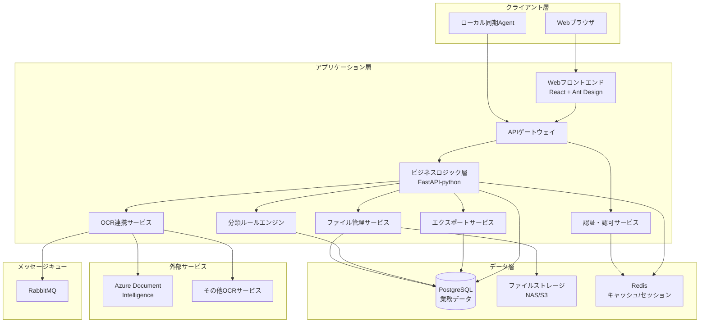

### 2.2 システム構成要素

| コンポーネント | 技術スタック | 役割 |
|--------------|------------|------|
| Webフロントエンド | React 18 + Ant Design 5 | ユーザーインターフェース |
| APIサーバー | FastAPI(python) | ビジネスロジック処理 |
| データベース | PostgreSQL 15 | 業務データ永続化 |
| キャッシュ | Redis 7 | セッション管理・高速アクセス |
| ファイルストレージ | NAS/AWS S3 | 画像・PDF保管 |
| メッセージキュー | RabbitMQ 3.x | 非同期タスク管理 |
| OCRサービス | Azure Document Intelligence | 文字認識 |
| ローカルAgent | watchdog（定番）/ watchfiles（高速・シンプル） | ローカルフォルダ監視 |

### 2.3 ネットワーク構成

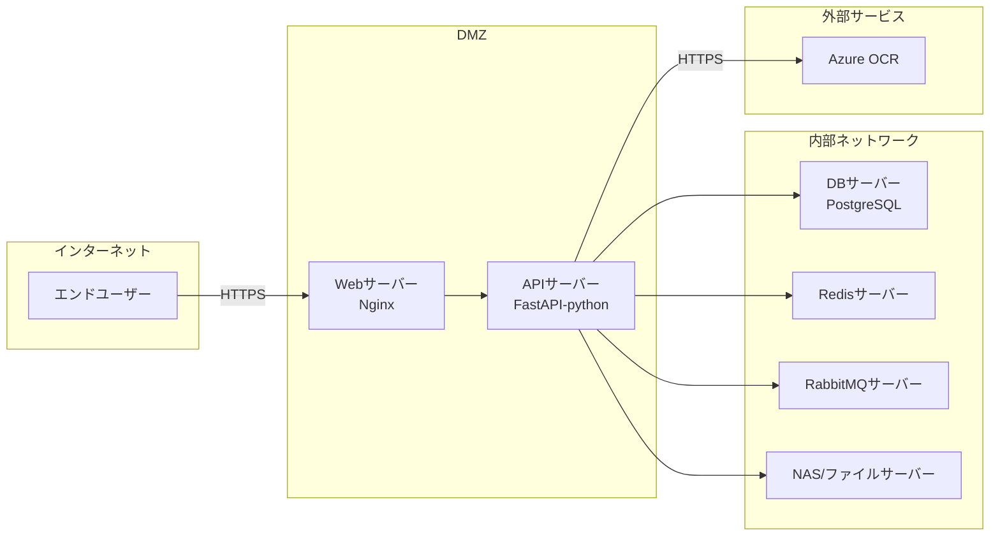

### 2.4 デプロイ構成

#### Phase 1 (V1.0)
- **環境**: 単一サーバー構成
- **スケーリング**: 垂直スケーリングのみ
- **冗長化**: なし(開発・小規模運用)

#### Phase 2 (将来)
- **環境**: マイクロサービス分離
- **スケーリング**: 水平スケーリング対応
- **冗長化**: ロードバランサー + 複数インスタンス

---

## 3. 機能一覧

### 3.1 機能マップ

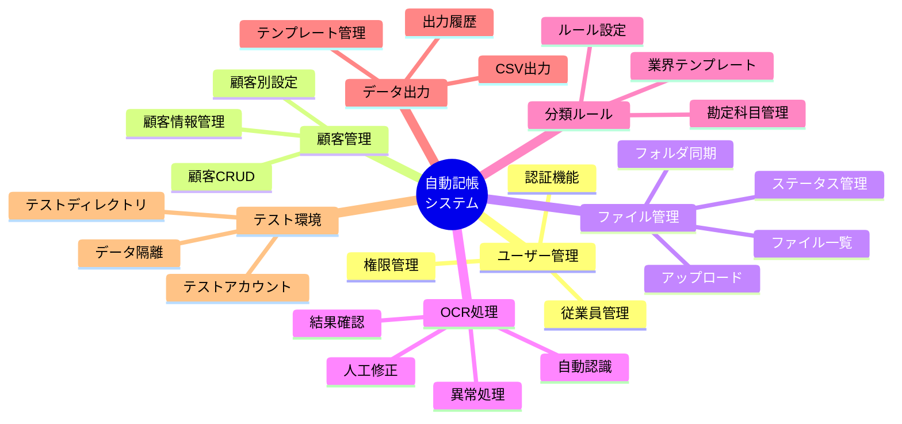

### 3.2 機能一覧表

#### 3.2.1 認証・ユーザー管理機能

| 機能ID | 機能名 | 概要 | 優先度 | 対応Role |
|-------|--------|------|--------|---------|
| F-AUTH-001 | ログイン | メールアドレス・パスワードでログイン | P0 | 全員 |
| F-AUTH-002 | ログアウト | セッション終了 | P0 | 全員 |
| F-AUTH-003 | パスワード変更 | 自身のパスワード変更 | P0 | 全員 |
| F-AUTH-004 | パスワードリセット | 管理者による強制リセット | P1 | 管理者 |
| F-USER-001 | 従業員一覧 | 従業員の一覧表示・検索 | P0 | 管理者 |
| F-USER-002 | 従業員登録 | 新規従業員アカウント作成 | P0 | 管理者 |
| F-USER-003 | 従業員編集 | 従業員情報更新 | P0 | 管理者 |
| F-USER-004 | 従業員削除/無効化 | アカウント停止 | P0 | 管理者 |
| F-USER-005 | 権限管理 | ロール割り当て | P0 | 管理者 |

#### 3.2.2 顧客管理機能

| 機能ID | 機能名 | 概要 | 優先度 | 対応Role |
|-------|--------|------|--------|---------|
| F-CUST-001 | 顧客一覧 | 顧客一覧表示・検索・ソート | P0 | 管理者・一般 |
| F-CUST-002 | 顧客登録 | 新規顧客情報登録 | P0 | 管理者 |
| F-CUST-003 | 顧客詳細 | 顧客詳細情報表示 | P0 | 管理者・一般 |
| F-CUST-004 | 顧客編集 | 顧客情報更新 | P0 | 管理者 |
| F-CUST-005 | 顧客削除 | 顧客情報論理削除 | P0 | 管理者 |
| F-CUST-006 | 顧客選択 | 作業対象顧客の選択 | P0 | 全員 |

#### 3.2.3 ファイル管理機能

| 機能ID | 機能名 | 概要 | 優先度 | 対応Role |
|-------|--------|------|--------|---------|
| F-FILE-001 | ファイル選択アップロード | 単一/複数ファイル選択アップロード | P0 | 管理者・一般 |
| F-FILE-002 | ドラッグ&ドロップアップロード | D&Dでのアップロード | P0 | 管理者・一般 |
| F-FILE-003 | フォルダアップロード | フォルダ一括アップロード | P0 | 管理者・一般 |
| F-FILE-004 | ローカルフォルダ同期設定 | 監視フォルダ設定 | P1 | 管理者 |
| F-FILE-005 | 自動同期 | 定期的な新規ファイル取込 | P1 | システム |
| F-FILE-006 | ファイル一覧 | アップロード済みファイル一覧 | P0 | 管理者・一般 |
| F-FILE-007 | ファイル検索 | 顧客・日付・ステータスで検索 | P0 | 管理者・一般 |
| F-FILE-008 | ファイルプレビュー | 画像・PDFのプレビュー表示 | P1 | 管理者・一般 |
| F-FILE-009 | ファイル削除 | アップロード済みファイル削除 | P0 | 管理者 |

#### 3.2.4 OCR処理機能

| 機能ID | 機能名 | 概要 | 優先度 | 対応Role |
|-------|--------|------|--------|---------|
| F-OCR-001 | OCR自動実行 | アップロード後の自動OCR処理 | P0 | システム |
| F-OCR-002 | OCR手動実行 | 手動でOCR再実行 | P1 | 管理者・一般 |
| F-OCR-003 | OCR結果一覧 | 認識結果の一覧表示 | P0 | 管理者・一般 |
| F-OCR-004 | OCR結果詳細 | 認識結果詳細表示 | P0 | 管理者・一般 |
| F-OCR-005 | 認識結果編集 | フィールド値の手動修正 | P0 | 管理者・一般 |
| F-OCR-006 | 異常検知 | 認識失敗・低信頼度の自動検知 | P0 | システム |
| F-OCR-007 | 異常ファイル一覧 | 要確認ファイルの一覧 | P0 | 管理者・一般 |
| F-OCR-008 | 画像前処理 | 傾き補正・ノイズ除去 | P1 | システム |
| F-OCR-009 | 信頼度表示 | フィールド毎の信頼度表示 | P1 | 管理者・一般 |

#### 3.2.5 分類・ルール管理機能

| 機能ID | 機能名 | 概要 | 優先度 | 対応Role |
|-------|--------|------|--------|---------|
| F-RULE-001 | 勘定科目一覧 | 勘定科目マスタ一覧 | P0 | 管理者 |
| F-RULE-002 | 勘定科目登録 | 新規勘定科目追加 | P0 | 管理者 |
| F-RULE-003 | 勘定科目編集 | 勘定科目情報更新 | P0 | 管理者 |
| F-RULE-004 | 勘定科目削除 | 勘定科目無効化 | P0 | 管理者 |
| F-RULE-005 | 分類ルール一覧 | 自動分類ルール一覧 | P0 | 管理者 |
| F-RULE-006 | 分類ルール登録 | 新規ルール作成 | P0 | 管理者 |
| F-RULE-007 | 分類ルール編集 | ルール条件・優先度編集 | P0 | 管理者 |
| F-RULE-008 | 分類ルール削除 | ルール削除 | P0 | 管理者 |
| F-RULE-009 | 業界テンプレート適用 | 業界別デフォルトルール適用 | P1 | 管理者 |
| F-RULE-010 | ルール適用実行 | OCR結果への自動分類実行 | P0 | システム |
| F-RULE-011 | ルールマッチングログ | ルール適用履歴確認 | P1 | 管理者 |

#### 3.2.6 データ出力機能

| 機能ID | 機能名 | 概要 | 優先度 | 対応Role |
|-------|--------|------|--------|---------|
| F-EXPORT-001 | CSV出力 | 仕訳データのCSV出力 | P0 | 全員 |
| F-EXPORT-002 | 出力対象選択 | 顧客・期間・ステータスで絞込 | P0 | 全員 |
| F-EXPORT-003 | テンプレート選択 | 出力フォーマット選択 | P0 | 全員 |
| F-EXPORT-004 | テンプレート管理 | 出力テンプレートCRUD | P1 | 管理者 |
| F-EXPORT-005 | 文字コード選択 | UTF-8/Shift-JIS選択 | P0 | 全員 |
| F-EXPORT-006 | 出力履歴 | 過去の出力履歴一覧 | P1 | 全員 |
| F-EXPORT-007 | ファイル再ダウンロード | 過去出力ファイルの再取得 | P1 | 全員 |

#### 3.2.7 テスト環境機能

| 機能ID | 機能名 | 概要 | 優先度 | 対応Role |
|-------|--------|------|--------|---------|
| F-TEST-001 | テストモード切替 | テスト/本番環境切替 | P1 | 全員 |
| F-TEST-002 | テストデータ隔離 | テストデータの完全分離 | P1 | システム |
| F-TEST-003 | テストアカウント | テスト専用アカウント発行 | P1 | 管理者 |
| F-TEST-004 | テストデータリセット | テストデータの一括削除 | P1 | 管理者 |

#### 3.2.8 システム管理機能

| 機能ID | 機能名 | 概要 | 優先度 | 対応Role |
|-------|--------|------|--------|---------|
| F-SYS-001 | ダッシュボード | 処理状況サマリー表示 | P1 | 管理者 |
| F-SYS-002 | 操作ログ一覧 | ユーザー操作履歴確認 | P1 | 管理者 |
| F-SYS-003 | システム設定 | OCR APIキー設定等 | P0 | 管理者 |
| F-SYS-004 | ヘルプ・マニュアル | 操作マニュアル表示 | P1 | 全員 |

### 3.3 権限マトリクス

| 機能カテゴリ | 管理者 | 一般職員 | 審査員 | 閲覧のみ |
|------------|-------|---------|--------|---------|
| 従業員管理 | ○ | × | × | × |
| 顧客管理 | ○ | △ | × | × |
| ファイルアップロード | ○ | ○ | × | × |
| OCR結果確認 | ○ | ○ | ○ | ○ |
| OCR結果編集 | ○ | ○ | ○ | × |
| 勘定科目管理 | ○ | × | × | × |
| 分類ルール管理 | ○ | △ | × | × |
| データ出力 | ○ | ○ | ○ | ○ |
| システム設定 | ○ | × | × | × |

**凡例**: ○=全機能利用可、△=一部機能のみ、×=利用不可

---

## 4. データモデル設計

### 4.1 ER図

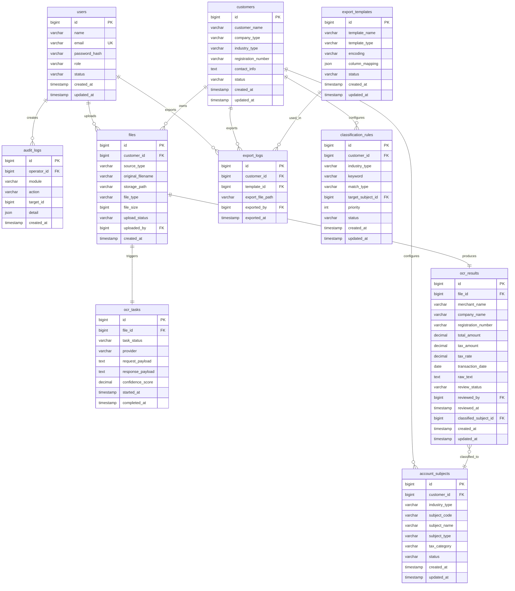

### 4.2 主要テーブル定義

#### 4.2.1 users（ユーザーテーブル）

| カラム名 | データ型 | NULL | キー | デフォルト | 説明 |
|---------|---------|------|-----|----------|------|
| id | BIGINT | NO | PK | AUTO_INCREMENT | ユーザーID |
| name | VARCHAR(100) | NO | | | 氏名 |
| email | VARCHAR(255) | NO | UK | | メールアドレス |
| password_hash | VARCHAR(255) | NO | | | パスワードハッシュ |
| role | VARCHAR(50) | NO | | 'GENERAL' | ロール(ADMIN/GENERAL/REVIEWER/READONLY) |
| status | VARCHAR(20) | NO | | 'ACTIVE' | ステータス(ACTIVE/INACTIVE) |
| created_at | TIMESTAMP | NO | | CURRENT_TIMESTAMP | 作成日時 |
| updated_at | TIMESTAMP | NO | | CURRENT_TIMESTAMP | 更新日時 |

**インデックス:**
- PRIMARY KEY (id)
- UNIQUE KEY (email)
- INDEX (status)

#### 4.2.2 customers（顧客テーブル）

| カラム名 | データ型 | NULL | キー | デフォルト | 説明 |
|---------|---------|------|-----|----------|------|
| id | BIGINT | NO | PK | AUTO_INCREMENT | 顧客ID |
| customer_name | VARCHAR(200) | NO | | | 顧客名 |
| company_type | VARCHAR(50) | YES | | | 法人格(株式会社/合同会社等) |
| industry_type | VARCHAR(50) | YES | | | 業種 |
| registration_number | VARCHAR(50) | YES | | | 適格請求書発行事業者番号 |
| contact_info | TEXT | YES | | | 連絡先情報(JSON) |
| status | VARCHAR(20) | NO | | 'ACTIVE' | ステータス(ACTIVE/INACTIVE) |
| created_at | TIMESTAMP | NO | | CURRENT_TIMESTAMP | 作成日時 |
| updated_at | TIMESTAMP | NO | | CURRENT_TIMESTAMP | 更新日時 |

**インデックス:**
- PRIMARY KEY (id)
- INDEX (customer_name)
- INDEX (industry_type)
- INDEX (status)

#### 4.2.3 files（ファイルテーブル）

| カラム名 | データ型 | NULL | キー | デフォルト | 説明 |
|---------|---------|------|-----|----------|------|
| id | BIGINT | NO | PK | AUTO_INCREMENT | ファイルID |
| customer_id | BIGINT | NO | FK | | 顧客ID |
| source_type | VARCHAR(50) | NO | | 'MANUAL' | 取込元(MANUAL/FOLDER_SYNC/TEST) |
| original_filename | VARCHAR(255) | NO | | | 元ファイル名 |
| storage_path | VARCHAR(500) | NO | | | 保存先パス |
| file_type | VARCHAR(20) | NO | | | ファイル形式(JPG/PNG/PDF) |
| file_size | BIGINT | NO | | | ファイルサイズ(bytes) |
| upload_status | VARCHAR(50) | NO | | 'PENDING' | アップロードステータス |
| uploaded_by | BIGINT | NO | FK | | アップロードユーザーID |
| created_at | TIMESTAMP | NO | | CURRENT_TIMESTAMP | 作成日時 |

**インデックス:**
- PRIMARY KEY (id)
- FOREIGN KEY (customer_id) REFERENCES customers(id)
- FOREIGN KEY (uploaded_by) REFERENCES users(id)
- INDEX (customer_id, created_at)
- INDEX (upload_status)

#### 4.2.4 ocr_tasks（OCRタスクテーブル）

| カラム名 | データ型 | NULL | キー | デフォルト | 説明 |
|---------|---------|------|-----|----------|------|
| id | BIGINT | NO | PK | AUTO_INCREMENT | タスクID |
| file_id | BIGINT | NO | FK | | ファイルID |
| task_status | VARCHAR(50) | NO | | 'PENDING' | タスクステータス |
| provider | VARCHAR(50) | NO | | 'AZURE' | OCRプロバイダー |
| request_payload | TEXT | YES | | | リクエストデータ(JSON) |
| response_payload | TEXT | YES | | | レスポンスデータ(JSON) |
| confidence_score | DECIMAL(5,2) | YES | | | 信頼度スコア |
| started_at | TIMESTAMP | YES | | | 開始日時 |
| completed_at | TIMESTAMP | YES | | | 完了日時 |

**インデックス:**
- PRIMARY KEY (id)
- FOREIGN KEY (file_id) REFERENCES files(id)
- INDEX (file_id)
- INDEX (task_status)

#### 4.2.5 ocr_results（OCR結果テーブル）

| カラム名 | データ型 | NULL | キー | デフォルト | 説明 |
|---------|---------|------|-----|----------|------|
| id | BIGINT | NO | PK | AUTO_INCREMENT | 結果ID |
| file_id | BIGINT | NO | FK | | ファイルID |
| merchant_name | VARCHAR(200) | YES | | | 店舗名 |
| company_name | VARCHAR(200) | YES | | | 会社名 |
| registration_number | VARCHAR(50) | YES | | | 登録番号 |
| total_amount | DECIMAL(15,2) | YES | | | 合計金額 |
| tax_amount | DECIMAL(15,2) | YES | | | 消費税額 |
| tax_rate | DECIMAL(5,2) | YES | | | 税率 |
| transaction_date | DATE | YES | | | 取引日 |
| raw_text | TEXT | YES | | | OCR生テキスト |
| review_status | VARCHAR(50) | NO | | 'PENDING' | 確認ステータス |
| reviewed_by | BIGINT | YES | FK | | 確認者ID |
| reviewed_at | TIMESTAMP | YES | | | 確認日時 |
| classified_subject_id | BIGINT | YES | FK | | 分類された勘定科目ID |
| created_at | TIMESTAMP | NO | | CURRENT_TIMESTAMP | 作成日時 |
| updated_at | TIMESTAMP | NO | | CURRENT_TIMESTAMP | 更新日時 |

**インデックス:**
- PRIMARY KEY (id)
- FOREIGN KEY (file_id) REFERENCES files(id)
- FOREIGN KEY (reviewed_by) REFERENCES users(id)
- FOREIGN KEY (classified_subject_id) REFERENCES account_subjects(id)
- INDEX (file_id)
- INDEX (review_status)
- INDEX (transaction_date)

#### 4.2.6 account_subjects（勘定科目テーブル）

| カラム名 | データ型 | NULL | キー | デフォルト | 説明 |
|---------|---------|------|-----|----------|------|
| id | BIGINT | NO | PK | AUTO_INCREMENT | 科目ID |
| customer_id | BIGINT | YES | FK | | 顧客ID(NULL=共通) |
| industry_type | VARCHAR(50) | YES | | | 業種(NULL=全業種) |
| subject_code | VARCHAR(20) | NO | | | 科目コード |
| subject_name | VARCHAR(100) | NO | | | 科目名 |
| subject_type | VARCHAR(50) | NO | | | 科目区分(資産/負債/資本/収益/費用) |
| tax_category | VARCHAR(50) | YES | | | 税区分 |
| status | VARCHAR(20) | NO | | 'ACTIVE' | ステータス |
| created_at | TIMESTAMP | NO | | CURRENT_TIMESTAMP | 作成日時 |
| updated_at | TIMESTAMP | NO | | CURRENT_TIMESTAMP | 更新日時 |

**インデックス:**
- PRIMARY KEY (id)
- FOREIGN KEY (customer_id) REFERENCES customers(id)
- UNIQUE KEY (customer_id, subject_code)
- INDEX (industry_type)

#### 4.2.7 classification_rules（分類ルールテーブル）

| カラム名 | データ型 | NULL | キー | デフォルト | 説明 |
|---------|---------|------|-----|----------|------|
| id | BIGINT | NO | PK | AUTO_INCREMENT | ルールID |
| customer_id | BIGINT | YES | FK | | 顧客ID(NULL=共通) |
| industry_type | VARCHAR(50) | YES | | | 業種(NULL=全業種) |
| keyword | VARCHAR(200) | NO | | | マッチングキーワード |
| match_type | VARCHAR(50) | NO | | 'PARTIAL' | マッチタイプ(EXACT/PARTIAL/REGEX) |
| target_subject_id | BIGINT | NO | FK | | 割り当て先科目ID |
| priority | INT | NO | | 100 | 優先度(小さいほど優先) |
| status | VARCHAR(20) | NO | | 'ACTIVE' | ステータス |
| created_at | TIMESTAMP | NO | | CURRENT_TIMESTAMP | 作成日時 |
| updated_at | TIMESTAMP | NO | | CURRENT_TIMESTAMP | 更新日時 |

**インデックス:**
- PRIMARY KEY (id)
- FOREIGN KEY (customer_id) REFERENCES customers(id)
- FOREIGN KEY (target_subject_id) REFERENCES account_subjects(id)
- INDEX (customer_id, priority)
- INDEX (keyword)

#### 4.2.8 export_templates（出力テンプレートテーブル）

| カラム名 | データ型 | NULL | キー | デフォルト | 説明 |
|---------|---------|------|-----|----------|------|
| id | BIGINT | NO | PK | AUTO_INCREMENT | テンプレートID |
| template_name | VARCHAR(100) | NO | | | テンプレート名 |
| template_type | VARCHAR(50) | NO | | 'CSV' | 出力形式 |
| encoding | VARCHAR(20) | NO | | 'UTF-8' | 文字エンコーディング |
| column_mapping | JSON | NO | | | カラムマッピング定義 |
| status | VARCHAR(20) | NO | | 'ACTIVE' | ステータス |
| created_at | TIMESTAMP | NO | | CURRENT_TIMESTAMP | 作成日時 |
| updated_at | TIMESTAMP | NO | | CURRENT_TIMESTAMP | 更新日時 |

**インデックス:**
- PRIMARY KEY (id)
- INDEX (template_name)

#### 4.2.9 export_logs（出力ログテーブル）

| カラム名 | データ型 | NULL | キー | デフォルト | 説明 |
|---------|---------|------|-----|----------|------|
| id | BIGINT | NO | PK | AUTO_INCREMENT | ログID |
| customer_id | BIGINT | NO | FK | | 顧客ID |
| template_id | BIGINT | NO | FK | | テンプレートID |
| export_file_path | VARCHAR(500) | NO | | | 出力ファイルパス |
| exported_by | BIGINT | NO | FK | | 出力実行者ID |
| exported_at | TIMESTAMP | NO | | CURRENT_TIMESTAMP | 出力日時 |

**インデックス:**
- PRIMARY KEY (id)
- FOREIGN KEY (customer_id) REFERENCES customers(id)
- FOREIGN KEY (template_id) REFERENCES export_templates(id)
- FOREIGN KEY (exported_by) REFERENCES users(id)
- INDEX (customer_id, exported_at)

#### 4.2.10 audit_logs（操作ログテーブル）

| カラム名 | データ型 | NULL | キー | デフォルト | 説明 |
|---------|---------|------|-----|----------|------|
| id | BIGINT | NO | PK | AUTO_INCREMENT | ログID |
| operator_id | BIGINT | YES | FK | | 操作者ID |
| module | VARCHAR(50) | NO | | | モジュール名 |
| action | VARCHAR(100) | NO | | | アクション |
| target_id | BIGINT | YES | | | 対象ID |
| detail | JSON | YES | | | 詳細情報 |
| created_at | TIMESTAMP | NO | | CURRENT_TIMESTAMP | 操作日時 |

**インデックス:**
- PRIMARY KEY (id)
- FOREIGN KEY (operator_id) REFERENCES users(id)
- INDEX (operator_id, created_at)
- INDEX (module, action)

---

## 5. API仕様概要

### 5.1 API基本設計方針

- **プロトコル**: RESTful API over HTTPS
- **認証方式**: JWT (JSON Web Token)
- **データフォーマット**: JSON
- **エラーレスポンス**: 統一フォーマット
- **ページネーション**: Offset/Limit方式
- **バージョニング**: URLパスでバージョン管理 (/api/v1/...)

### 5.2 共通レスポンス形式

#### 成功時

```json
{
  "success": true,
  "data": { /* レスポンスデータ */ },
  "message": "Success"
}
```

#### エラー時

```json
{
  "success": false,
  "error": {
    "code": "ERROR_CODE",
    "message": "エラーメッセージ",
    "details": []
  }
}
```

### 5.3 API エンドポイント一覧

#### 5.3.1 認証API

| メソッド | エンドポイント | 説明 | 認証 |
|---------|--------------|------|-----|
| POST | /api/v1/auth/login | ログイン | 不要 |
| POST | /api/v1/auth/logout | ログアウト | 必要 |
| POST | /api/v1/auth/refresh | トークン更新 | 必要 |
| POST | /api/v1/auth/password/change | パスワード変更 | 必要 |
| POST | /api/v1/auth/password/reset | パスワードリセット | 必要(管理者) |

**POST /api/v1/auth/login**

リクエスト:
```json
{
  "email": "user@example.com",
  "password": "password123"
}
```

レスポンス:
```json
{
  "success": true,
  "data": {
    "token": "eyJhbGciOiJIUzI1NiIs...",
    "refreshToken": "eyJhbGciOiJIUzI1NiIs...",
    "user": {
      "id": 1,
      "name": "山田太郎",
      "email": "user@example.com",
      "role": "ADMIN"
    }
  }
}
```

#### 5.3.2 ユーザー管理API

| メソッド | エンドポイント | 説明 | 権限 |
|---------|--------------|------|-----|
| GET | /api/v1/users | ユーザー一覧取得 | 管理者 |
| GET | /api/v1/users/:id | ユーザー詳細取得 | 管理者 |
| POST | /api/v1/users | ユーザー登録 | 管理者 |
| PUT | /api/v1/users/:id | ユーザー更新 | 管理者 |
| DELETE | /api/v1/users/:id | ユーザー削除 | 管理者 |

**GET /api/v1/users**

リクエストパラメータ:
```
?page=1&limit=20&role=GENERAL&status=ACTIVE&search=山田
```

レスポンス:
```json
{
  "success": true,
  "data": {
    "items": [
      {
        "id": 1,
        "name": "山田太郎",
        "email": "yamada@example.com",
        "role": "ADMIN",
        "status": "ACTIVE",
        "createdAt": "2026-01-01T00:00:00Z"
      }
    ],
    "total": 100,
    "page": 1,
    "limit": 20
  }
}
```

#### 5.3.3 顧客管理API

| メソッド | エンドポイント | 説明 | 権限 |
|---------|--------------|------|-----|
| GET | /api/v1/customers | 顧客一覧取得 | 全員 |
| GET | /api/v1/customers/:id | 顧客詳細取得 | 全員 |
| POST | /api/v1/customers | 顧客登録 | 管理者 |
| PUT | /api/v1/customers/:id | 顧客更新 | 管理者 |
| DELETE | /api/v1/customers/:id | 顧客削除 | 管理者 |

**POST /api/v1/customers**

リクエスト:
```json
{
  "customerName": "株式会社サンプル",
  "companyType": "株式会社",
  "industryType": "飲食業",
  "registrationNumber": "T1234567890123",
  "contactInfo": {
    "phone": "03-1234-5678",
    "email": "contact@sample.co.jp"
  }
}
```

#### 5.3.4 ファイル管理API

| メソッド | エンドポイント | 説明 | 権限 |
|---------|--------------|------|-----|
| GET | /api/v1/files | ファイル一覧取得 | 一般以上 |
| GET | /api/v1/files/:id | ファイル詳細取得 | 一般以上 |
| POST | /api/v1/files/upload | ファイルアップロード | 一般以上 |
| DELETE | /api/v1/files/:id | ファイル削除 | 管理者 |
| GET | /api/v1/files/:id/download | ファイルダウンロード | 一般以上 |

**POST /api/v1/files/upload**

リクエスト (multipart/form-data):
```
customerId: 123
files: [file1.jpg, file2.pdf]
sourceType: MANUAL
```

レスポンス:
```json
{
  "success": true,
  "data": {
    "uploadedFiles": [
      {
        "id": 1001,
        "originalFilename": "receipt001.jpg",
        "fileSize": 1024000,
        "uploadStatus": "UPLOADED"
      }
    ],
    "failedFiles": []
  }
}
```

#### 5.3.5 OCR処理API

| メソッド | エンドポイント | 説明 | 権限 |
|---------|--------------|------|-----|
| GET | /api/v1/ocr/results | OCR結果一覧取得 | 一般以上 |
| GET | /api/v1/ocr/results/:id | OCR結果詳細取得 | 一般以上 |
| PUT | /api/v1/ocr/results/:id | OCR結果編集 | 一般以上 |
| POST | /api/v1/ocr/tasks/:fileId/retry | OCR再実行 | 一般以上 |
| GET | /api/v1/ocr/exceptions | 異常ファイル一覧 | 一般以上 |

**GET /api/v1/ocr/results**

リクエストパラメータ:
```
?customerId=123&dateFrom=2026-01-01&dateTo=2026-01-31&reviewStatus=PENDING&page=1&limit=50
```

レスポンス:
```json
{
  "success": true,
  "data": {
    "items": [
      {
        "id": 5001,
        "fileId": 1001,
        "merchantName": "コンビニA",
        "totalAmount": 1500,
        "taxAmount": 150,
        "taxRate": 10,
        "transactionDate": "2026-01-15",
        "reviewStatus": "PENDING",
        "confidenceScore": 95.5
      }
    ],
    "total": 250,
    "page": 1,
    "limit": 50
  }
}
```

**PUT /api/v1/ocr/results/:id**

リクエスト:
```json
{
  "merchantName": "コンビニA 渋谷店",
  "totalAmount": 1580,
  "taxAmount": 158,
  "transactionDate": "2026-01-15",
  "reviewStatus": "APPROVED"
}
```

#### 5.3.6 分類ルールAPI

| メソッド | エンドポイント | 説明 | 権限 |
|---------|--------------|------|-----|
| GET | /api/v1/account-subjects | 勘定科目一覧 | 管理者 |
| POST | /api/v1/account-subjects | 勘定科目登録 | 管理者 |
| PUT | /api/v1/account-subjects/:id | 勘定科目更新 | 管理者 |
| DELETE | /api/v1/account-subjects/:id | 勘定科目削除 | 管理者 |
| GET | /api/v1/classification-rules | 分類ルール一覧 | 管理者 |
| POST | /api/v1/classification-rules | 分類ルール登録 | 管理者 |
| PUT | /api/v1/classification-rules/:id | 分類ルール更新 | 管理者 |
| DELETE | /api/v1/classification-rules/:id | 分類ルール削除 | 管理者 |
| POST | /api/v1/classification-rules/apply | ルール適用実行 | 管理者 |

#### 5.3.7 データ出力API

| メソッド | エンドポイント | 説明 | 権限 |
|---------|--------------|------|-----|
| POST | /api/v1/export/csv | CSV出力 | 全員 |
| GET | /api/v1/export/templates | テンプレート一覧 | 全員 |
| GET | /api/v1/export/logs | 出力履歴 | 全員 |
| GET | /api/v1/export/logs/:id/download | 出力ファイル再取得 | 全員 |

**POST /api/v1/export/csv**

リクエスト:
```json
{
  "customerId": 123,
  "dateFrom": "2026-01-01",
  "dateTo": "2026-01-31",
  "templateId": 1,
  "encoding": "Shift_JIS",
  "includeStatus": ["APPROVED"]
}
```

レスポンス:
```json
{
  "success": true,
  "data": {
    "exportId": 9001,
    "filename": "export_20260131_123.csv",
    "downloadUrl": "/api/v1/export/logs/9001/download",
    "recordCount": 120
  }
}
```

#### 5.3.8 システム管理API

| メソッド | エンドポイント | 説明 | 権限 |
|---------|--------------|------|-----|
| GET | /api/v1/system/dashboard | ダッシュボード情報 | 管理者 |
| GET | /api/v1/system/audit-logs | 操作ログ一覧 | 管理者 |
| GET | /api/v1/system/settings | システム設定取得 | 管理者 |
| PUT | /api/v1/system/settings | システム設定更新 | 管理者 |

### 5.4 エラーコード一覧

| コード | 説明 |
|-------|------|
| AUTH_001 | 認証失敗 |
| AUTH_002 | トークン期限切れ |
| AUTH_003 | 権限不足 |
| VAL_001 | バリデーションエラー |
| VAL_002 | 必須項目未入力 |
| VAL_003 | 形式不正 |
| DB_001 | データベースエラー |
| DB_002 | データ重複エラー |
| DB_003 | データ不存在 |
| FILE_001 | ファイルアップロード失敗 |
| FILE_002 | ファイル形式不正 |
| FILE_003 | ファイルサイズ超過 |
| OCR_001 | OCR処理失敗 |
| OCR_002 | OCR API接続エラー |
| SYS_001 | システムエラー |

---

## 6. 画面設計

### 6.1 画面遷移図

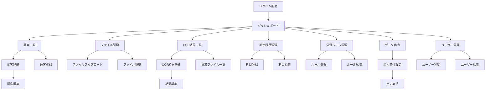

### 6.2 主要画面一覧

| 画面ID | 画面名 | 説明 | アクセス権 |
|-------|--------|------|----------|
| SCR-001 | ログイン画面 | システムログイン | 全員 |
| SCR-002 | ダッシュボード | 処理状況サマリー表示 | 全員 |
| SCR-003 | 顧客一覧 | 顧客一覧・検索 | 全員 |
| SCR-004 | 顧客詳細 | 顧客詳細情報表示 | 全員 |
| SCR-005 | 顧客登録/編集 | 顧客情報入力フォーム | 管理者 |
| SCR-006 | ファイル管理 | ファイル一覧・アップロード | 一般以上 |
| SCR-007 | ファイルアップロード | ドラッグ&ドロップアップロード | 一般以上 |
| SCR-008 | OCR結果一覧 | 認識結果一覧・検索 | 全員 |
| SCR-009 | OCR結果詳細 | 認識結果詳細・編集 | 一般以上 |
| SCR-010 | 異常ファイル一覧 | 要確認ファイル一覧 | 一般以上 |
| SCR-011 | 勘定科目管理 | 科目マスタ一覧・編集 | 管理者 |
| SCR-012 | 分類ルール管理 | ルール一覧・編集 | 管理者 |
| SCR-013 | データ出力 | CSV出力条件設定 | 全員 |
| SCR-014 | 出力履歴 | 過去の出力履歴一覧 | 全員 |
| SCR-015 | ユーザー管理 | 従業員アカウント管理 | 管理者 |
| SCR-016 | システム設定 | OCR APIキー等の設定 | 管理者 |
| SCR-017 | 操作ログ | 操作履歴一覧 | 管理者 |

### 6.3 画面レイアウト構成

全画面共通レイアウト:

```
+--------------------------------------------------+
|  ヘッダー (ロゴ/ユーザー情報/ログアウト)            |
+----------+---------------------------------------+
|          |                                       |
|  サイド   |                                       |
|  メニュー  |        メインコンテンツエリア           |
|          |                                       |
|          |                                       |
+----------+---------------------------------------+
|  フッター (バージョン情報等)                        |
+--------------------------------------------------+
```

### 6.4 主要画面ワイヤーフレーム

#### 6.4.1 ログイン画面 (SCR-001)

```
+----------------------------------------+
|                                        |
|          システムロゴ                   |
|                                        |
|  +----------------------------------+  |
|  | メールアドレス                     |  |
|  | [                            ]   |  |
|  +----------------------------------+  |
|                                        |
|  +----------------------------------+  |
|  | パスワード                         |  |
|  | [                            ]   |  |
|  +----------------------------------+  |
|                                        |
|  [ ログイン ]                          |
|                                        |
|  パスワードをお忘れの場合               |
|                                        |
+----------------------------------------+
```

#### 6.4.2 ダッシュボード (SCR-002)

```
+--------------------------------------------------+
| ヘッダー                                          |
+------+-------------------------------------------+
| メニュー | 【ダッシュボード】                       |
|      |                                           |
|      | +---------+ +---------+ +---------+       |
|      | | 今月の  | | 処理中  | | 要確認  |       |
|      | | 処理件数| | ファイル| | ファイル|       |
|      | |   320  | |   15   | |    8   |       |
|      | +---------+ +---------+ +---------+       |
|      |                                           |
|      | 【最近のアクティビティ】                   |
|      | +-------------------------------------+   |
|      | | 2026/01/31 10:30 山田太郎           |   |
|      | | 顧客「ABC商事」のファイル15件アップロード|   |
|      | +-------------------------------------+   |
|      | | 2026/01/31 09:15 佐藤花子           |   |
|      | | OCR結果20件を承認                   |   |
|      | +-------------------------------------+   |
|      |                                           |
+------+-------------------------------------------+
```

#### 6.4.3 ファイルアップロード (SCR-007)

```
+--------------------------------------------------+
| ヘッダー                                          |
+------+-------------------------------------------+
| メニュー | 【ファイルアップロード】                 |
|      |                                           |
|      | 顧客選択: [ABC商事 ▼]                    |
|      |                                           |
|      | +-------------------------------------+   |
|      | |                                     |   |
|      | |   ここにファイルをドラッグ&ドロップ   |   |
|      | |         または                      |   |
|      | |    [ ファイルを選択 ]               |   |
|      | |                                     |   |
|      | +-------------------------------------+   |
|      |                                           |
|      | アップロード済み:                         |
|      | +-------------------------------------+   |
|      | | receipt001.jpg  1.2MB  [削除]       |   |
|      | | receipt002.pdf  850KB  [削除]       |   |
|      | +-------------------------------------+   |
|      |                                           |
|      | [ アップロード開始 ] [ キャンセル ]       |
|      |                                           |
+------+-------------------------------------------+
```

#### 6.4.4 OCR結果一覧 (SCR-008)

```
+--------------------------------------------------+
| ヘッダー                                          |
+------+-------------------------------------------+
| メニュー | 【OCR結果一覧】                         |
|      |                                           |
|      | 顧客: [全て▼] 期間: [2026/01▼]          |
|      | ステータス: [全て▼] [検索]               |
|      |                                           |
|      | +-------------------------------------+   |
|      | | 日付     | 店舗名  | 金額 | 状態    |   |
|      | +-------------------------------------+   |
|      | | 01/15    | コンビニA| 1,500| 確認待ち|   |
|      | | 01/16    | レストランB|3,200|承認済み|   |
|      | | 01/17    | ?(不明) | -    | 異常   |   |
|      | +-------------------------------------+   |
|      |                                           |
|      | [1] 2 3 4 5 ... 次へ                     |
|      |                                           |
+------+-------------------------------------------+
```

#### 6.4.5 OCR結果詳細/編集 (SCR-009)

```
+--------------------------------------------------+
| ヘッダー                                          |
+------+-------------------------------------------+
| メニュー | 【OCR結果詳細】                         |
|      |                                           |
|      | +-----------+  +-----------------------+   |
|      | |           |  | 店舗名: [コンビニA   ]   |
|      | | 画像      |  | 取引日: [2026/01/15 ]   |
|      | | プレビュー |  | 金額:   [1,500      ]   |
|      | |           |  | 消費税: [150        ]   |
|      | |           |  | 税率:   [10%        ]   |
|      | |           |  | 登録番号:[T12345... ]   |
|      | +-----------+  |                          |
|      |                | 勘定科目: [消耗品費▼]   |
|      |                | 信頼度: ★★★★☆ 85%     |
|      |                +-----------------------+   |
|      |                                           |
|      | OCR生テキスト:                            |
|      | +-------------------------------------+   |
|      | | コンビニA                            |   |
|      | | 2026年1月15日                        |   |
|      | | 合計 ¥1,500 (税込)                  |   |
|      | +-------------------------------------+   |
|      |                                           |
|      | [ 保存 ] [ 承認 ] [ 却下 ] [ 戻る ]      |
|      |                                           |
+------+-------------------------------------------+
```

---

## 7. 非機能要件

### 7.1 パフォーマンス要件

割愛!!!!!!!!!!!!!!!!!!!!!!!!!

### 7.2 可用性要件

割愛!!!!!!!!!!!!!!!!!!!!!!!!!

### 7.3 拡張性要件

| 項目 | Phase1 | Phase2(将来) |
割愛!!!!!!!!!!!!!!!!!!!!!!!!!

**スケーリング戦略:**
- Phase1: 垂直スケーリング(サーバースペックアップ)
- Phase2: 水平スケーリング(サーバー台数増加、マイクロサービス化)

### 7.4 セキュリティ要件

#### 7.4.1 認証・認可

割愛!!!!!!!!!!!!!!!!!!!!!!!!!

#### 7.4.2 データ保護

割愛!!!!!!!!!!!!!!!!!!!!!!!!!

#### 7.4.3 アクセス制御

割愛!!!!!!!!!!!!!!!!!!!!!!!!!

#### 7.4.4 脆弱性対策

割愛!!!!!!!!!!!!!!!!!!!!!!!!!

### 7.5 互換性要件

#### 7.5.1 ブラウザ対応

| ブラウザ | 対応バージョン |
|---------|---------------|
| Google Chrome | 最新版および1つ前のメジャーバージョン |
| Microsoft Edge | 最新版および1つ前のメジャーバージョン |
| Safari | 最新版 |
| Firefox | 最新版 |

**非対応:**
- Internet Explorer (全バージョン)
- 10年以上前の旧ブラウザ

#### 7.5.2 デバイス対応

| デバイス | Phase1 | Phase2 |
|---------|--------|--------|
| デスクトップPC | ○ | ○ |
| ノートPC | ○ | ○ |
| タブレット | △(閲覧のみ) | ○ |
| スマートフォン | × | △ |

**推奨解像度:** 1366x768以上

#### 7.5.3 OCRサービス互換性

| サービス | Phase1 | Phase2 |
|---------|--------|--------|
| Azure Document Intelligence | ○(メイン) | ○ |
| Google Cloud Vision API | - | ○ |
| AWS Textract | - | ○ |
| 日本国内OCRサービス | - | △ |

### 7.6 運用・保守性要件

#### 7.6.1 監視要件

割愛!!!!!!!!!!!!!!!!!!!!!!!!!

#### 7.6.2 ログ要件

| ログ種別 | 内容 | 保存期間 | ローテーション |
|---------|------|---------|---------------|
| アクセスログ | HTTP リクエスト/レスポンス | 3ヶ月 | 日次 |
| アプリケーションログ | INFO/WARN/ERROR | 1ヶ月 | 日次 |
| エラーログ | スタックトレース含む | 3ヶ月 | 日次 |
| 操作監査ログ | ユーザー操作履歴 | 1年 | 月次 |
| OCR処理ログ | OCRリクエスト/レスポンス | 6ヶ月 | 週次 |

**ログフォーマット:** JSON形式、タイムスタンプ(UTC)、リクエストID付与

#### 7.6.3 バックアップ要件

割愛!!!!!!!!!!!!!!!!!!!!!!!!!

**リストア手順書:** 別途運用マニュアルに記載

### 7.7 ユーザビリティ要件

割愛!!!!!!!!!!!!!!!!!!!!!!!!!

### 7.8 法規制・コンプライアンス要件

#### 7.8.1 電子帳簿保存法対応

割愛!!!!!!!!!!!!!!!!!!!!!!!!!

#### 7.8.2 インボイス制度対応

割愛!!!!!!!!!!!!!!!!!!!!!!!!!

#### 7.8.3 個人情報保護法対応

割愛!!!!!!!!!!!!!!!!!!!!!!!!!

### 7.9 環境要件

#### 7.9.1 開発環境

| 項目 | 内容 |
|-----|------|
| OS | Ubuntu 22.04 LTS / windows11 |
| IDE | PyCharm / VSCode |
| python | python3.14 |
| Node.js | 18.x LTS |
| postgre | postgre15 |
| Docker | 24.x |
| Git | 2.x |

#### 7.9.2 ステージング環境

割愛!!!!!!!!!!!!!!!!!!!!!!!!!

#### 7.9.3 本番環境(Phase1)

割愛!!!!!!!!!!!!!!!!!!!!!!!!!

---

## 8. セキュリティ設計

### 8.1 セキュリティアーキテクチャ

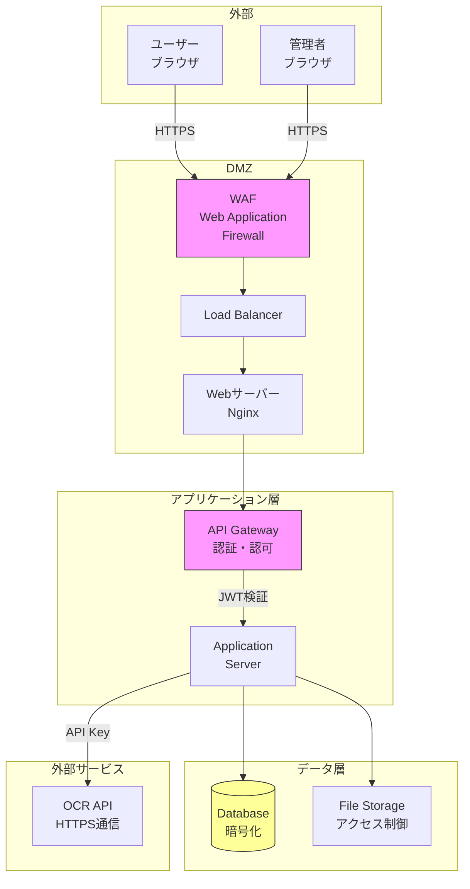

### 8.2 認証フロー

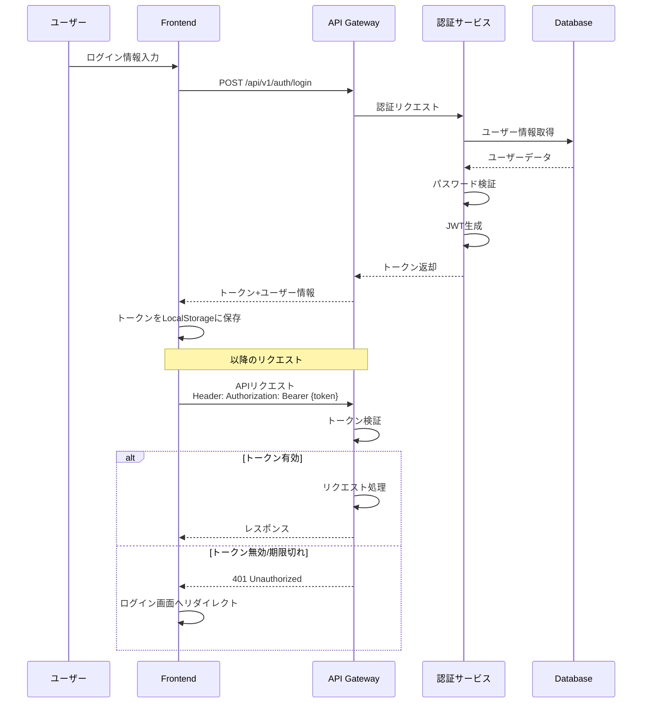

### 8.3 権限チェックフロー

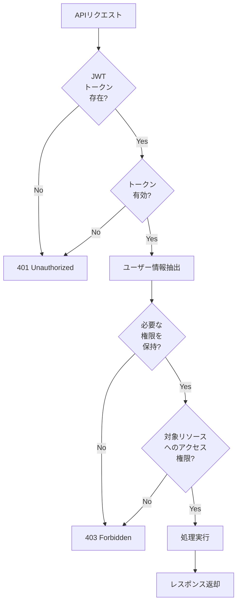

### 8.4 ファイルアップロードセキュリティ

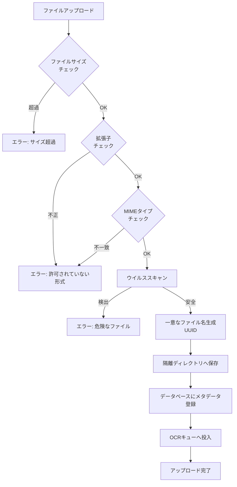

### 8.5 データマスキングルール

割愛!!!!!!!!!!!!!!!!!!!!!!!!!

### 8.6 セキュリティチェックリスト

#### 8.6.1 リリース前チェック

- [ ] 全APIエンドポイントに認証が実装されている
- [ ] ロールベースの権限チェックが実装されている
- [ ] SQLインジェクション対策(Prepared Statement)
- [ ] XSS対策(入力サニタイジング、出力エスケープ)
- [ ] CSRF対策(トークン検証)
- [ ] セキュアなHTTPヘッダー設定
- [ ] HTTPS強制リダイレクト
- [ ] パスワードの安全なハッシュ化(BCrypt)
- [ ] ファイルアップロードの検証
- [ ] エラーメッセージで機密情報を漏洩していない
- [ ] APIレートリミット実装
- [ ] セッションタイムアウト設定

#### 8.6.2 定期セキュリティ監査項目

- [ ] 脆弱性スキャン(OWASP ZAP等)
- [ ] ペネトレーションテスト
- [ ] 依存ライブラリの脆弱性チェック
- [ ] アクセスログ分析
- [ ] 不正アクセス試行の検出
- [ ] 権限設定の見直し
- [ ] 証明書の有効期限確認

---

## 9. 運用設計

### 9.1 システム運用体制

割愛!!!!!!!!!!!!!!!!!!!!!!!!!

### 9.2 運用業務一覧

#### 9.2.1 日次業務

割愛!!!!!!!!!!!!!!!!!!!!!!!!!

#### 9.2.2 週次業務

割愛!!!!!!!!!!!!!!!!!!!!!!!!!

#### 9.2.3 月次業務

割愛!!!!!!!!!!!!!!!!!!!!!!!!!

### 9.3 障害対応フロー

割愛!!!!!!!!!!!!!!!!!!!!!!!!!

### 9.4 障害レベル定義

割愛!!!!!!!!!!!!!!!!!!!!!!!!!

### 9.5 メンテナンス計画

#### 9.5.1 定期メンテナンス

割愛!!!!!!!!!!!!!!!!!!!!!!!!!

#### 9.5.2 メンテナンス通知フロー

割愛!!!!!!!!!!!!!!!!!!!!!!!!!

### 9.6 バックアップ・リカバリ手順

#### 9.6.1 バックアップ戦略

割愛!!!!!!!!!!!!!!!!!!!!!!!!!

#### 9.6.2 リストア手順

**データベースリストア:**

割愛!!!!!!!!!!!!!!!!!!!!!!!!!

**ファイルストレージリストア:**

割愛!!!!!!!!!!!!!!!!!!!!!!!!!

### 9.7 監視・アラート設定

#### 9.7.1 監視項目・閾値

割愛!!!!!!!!!!!!!!!!!!!!!!!!!

#### 9.7.2 アラート通知方法

割愛!!!!!!!!!!!!!!!!!!!!!!!!!

### 9.8 ドキュメント管理

#### 9.8.1 必須ドキュメント一覧

割愛!!!!!!!!!!!!!!!!!!!!!!!!!

### 9.9 ユーザーサポート

#### 9.9.1 サポート体制

割愛!!!!!!!!!!!!!!!!!!!!!!!!!

#### 9.9.2 FAQ管理

**よくある質問カテゴリ:**

1. **ログイン・アカウント関連**
   - パスワードを忘れた場合の対処法
   - ログインできない場合のチェックポイント

2. **ファイルアップロード関連**
   - アップロード可能なファイル形式
   - アップロードエラーの対処法
   - 大量ファイルのアップロード方法

3. **OCR関連**
   - 認識精度を上げる方法
   - 異常ファイルの対処方法
   - OCR結果の修正方法

4. **データ出力関連**
   - CSV出力のフォーマット変更方法
   - 文字化けの対処法
   - 会計ソフトへのインポート方法

---

## 10. 開発・テスト計画

### 10.1 開発スケジュール(想定)

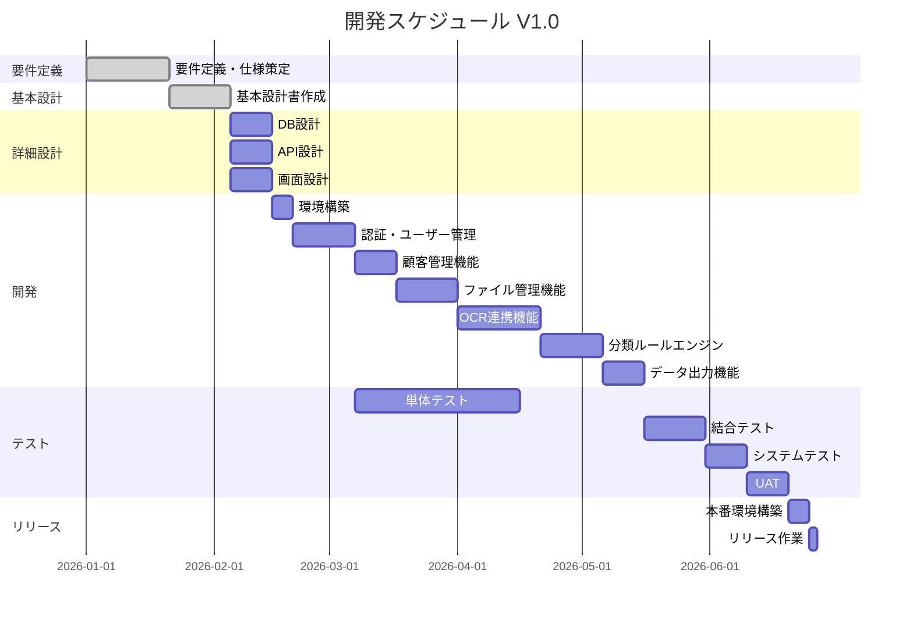

### 10.2 テスト戦略

#### 10.2.1 テストレベル

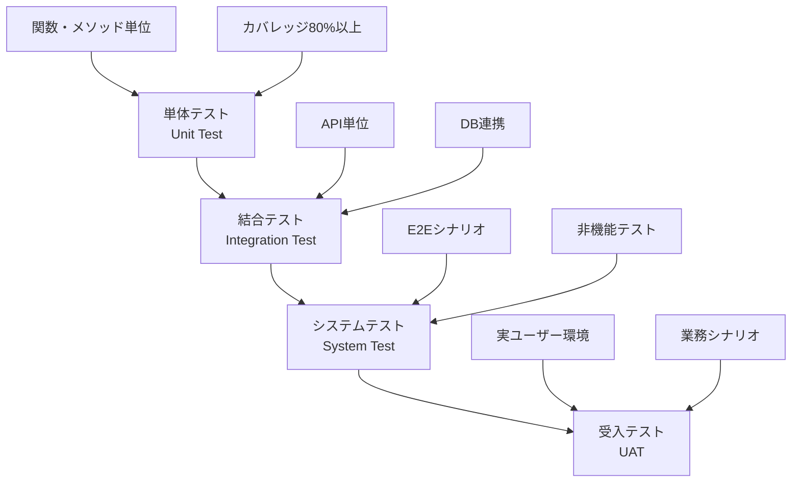

#### 10.2.2 テスト観点

| テスト種別 | テスト観点 | 実施者 | ツール |
|-----------|-----------|-------|--------|
| 単体テスト | ロジック正当性、境界値、異常系 | 開発者 | JUnit, Jest |
| 結合テスト | API仕様準拠、データ整合性 | 開発者 | Postman, RestAssured |
| システムテスト | 画面遷移、業務フロー、性能 | QA担当 | Selenium, JMeter |
| セキュリティテスト | 脆弱性、権限制御 | セキュリティ担当 | OWASP ZAP |
| 受入テスト | 要件充足、使用性 | ユーザー代表 | 手動テスト |

### 10.3 テストケース概要

#### 10.3.1 機能テストケースサンプル

**ログイン機能テストケース:**

| ケースID | テスト内容 | 入力値 | 期待結果 | 優先度 |
|---------|-----------|-------|---------|-------|
| TC-AUTH-001 | 正常ログイン | 正しいメール・パスワード | ダッシュボード表示 | High |
| TC-AUTH-002 | メール未入力 | 空欄 | エラーメッセージ表示 | High |
| TC-AUTH-003 | パスワード誤り | 誤ったパスワード | 認証エラー表示 | High |
| TC-AUTH-004 | 存在しないメール | 未登録メール | 認証エラー表示 | Medium |
| TC-AUTH-005 | 5回連続失敗 | 誤パスワード×5 | アカウントロック | High |

#### 10.3.2 性能テストシナリオ

| シナリオID | テスト内容 | 負荷条件 | 合格基準 |
|-----------|-----------|---------|---------|
| PT-001 | 通常負荷テスト | 同時50ユーザー | 応答時間3秒以内 |
| PT-002 | ピーク負荷テスト | 同時100ユーザー | 応答時間5秒以内、エラー率5%以下 |
| PT-003 | ファイルアップロード | 100ファイル同時 | 全ファイルアップロード成功 |
| PT-004 | OCR処理負荷 | 500件/時間 | キュー滞留なし |
| PT-005 | 長時間稳定性 | 24時間連続稼働 | メモリリークなし |

---

## 11. 用語集

| 用語 | 説明 |
|-----|------|
| OCR | Optical Character Recognition (光学文字認識) |
| JWT | JSON Web Token - 認証トークン形式 |
| RBAC | Role-Based Access Control - ロールベースアクセス制御 |
| CSRF | Cross-Site Request Forgery - クロスサイトリクエストフォージェリ |
| XSS | Cross-Site Scripting - クロスサイトスクリプティング |
| 勘定科目 | 会計上の取引内容を分類するための項目 |
| 仕訳 | 取引を借方・貸方に分けて記録すること |
| インボイス | 適格請求書 - 消費税の仕入税額控除に必要な請求書 |
| 適格請求書発行事業者 | インボイス制度に登録した事業者 |
| 電子帳簿保存法 | 国税関係帳簿書類の電子保存を認める法律 |
| タイムスタンプ | データの存在時刻を証明する技術 |

---

## 12. 付録

### 12.1 参考資料

- 電子帳簿保存法: https://www.nta.go.jp/law/joho-zeikaishaku/sonota/jirei/denshi.htm
- インボイス制度: https://www.nta.go.jp/taxes/shiraberu/zeimokubetsu/shohi/keigenzeiritsu/invoice.htm
- OWASP Top 10: https://owasp.org/www-project-top-ten/
- Azure Document Intelligence: https://azure.microsoft.com/ja-jp/products/ai-services/ai-document-intelligence

### 12.2 変更履歴管理

今後の仕様変更は以下の手順で管理する:

1. 変更要求の起票(GitHub Issue/Jira)
2. 影響範囲の分析
3. 設計レビュー
4. 基本設計書の更新
5. 変更履歴テーブルへの記録

### 12.3 今後の拡張予定(Phase2以降)

| 機能 | 概要 | 優先度 | 予定時期 |
|-----|------|-------|---------|
| スマートフォンアプリ | モバイル撮影→即時アップロード | High | Phase2 |
| AI学習機能 | 分類ルールの自動学習 | Medium | Phase3 |
| 多言語対応 | 英語UI対応 | Medium | Phase2 |
| タイムスタンプ連携 | 電帳法完全対応 | High | Phase2 |
| 会計ソフト直接連携 | API連携による自動仕訳 | High | Phase3 |
| 複数OCR並行処理 | 精度向上のための多重チェック | Low | Phase3 |
| ダッシュボード強化 | BIツール統合 | Low | Phase3 |

---

**以上**

---

## 補足事項

本基本設計書は、システム開発の指針となる重要文書です。
開発フェーズに入る前に、以下の確認を行ってください:

1. ✅ **要件の確認**: 全ステークホルダーが要件を理解しているか
2. ✅ **技術選定の妥当性**: 選定技術でPhase1要件を実現可能か
3. ✅ **リスクの洗い出し**: 特にOCR精度、性能面のリスク対策
4. ✅ **スケジュールの実現可能性**: 開発期間は適切か
5. ✅ **コスト試算**: OCR API利用料、インフラコストの妥当性