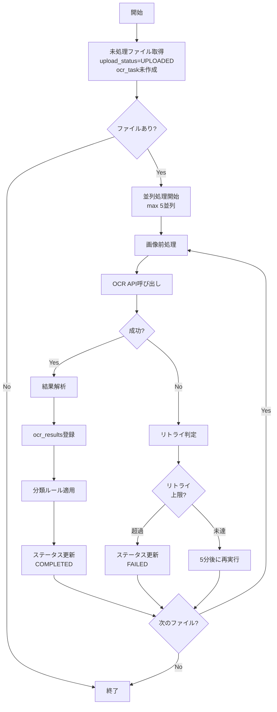

# 税理士向け自動記帳サービス 詳細設計書 V1.0

## 改訂履歴

| バージョン | 日付 | 作成者 | 変更内容 |
|----------|------|--------|---------|
| 1.0 | 2024-XX-XX | 開発チーム | 初版作成 |

---

## 目次

1. [画面詳細設計](#1-画面詳細設計)
2. [API詳細仕様](#2-api詳細仕様)
3. [データベース詳細設計](#3-データベース詳細設計)
4. [バッチ処理詳細設計](#4-バッチ処理詳細設計)
5. [外部連携詳細設計](#5-外部連携詳細設計)
6. [エラー処理詳細設計](#6-エラー処理詳細設計)

---

## 1. 画面詳細設計

### 1.1 共通UI設計

#### 1.1.1 レイアウト構成

```
┌─────────────────────────────────────────────────────────┐
│ ヘッダー (Header Component)                              │
│ ┌─────────┐ ┌──────────────┐ ┌────────────────────┐   │
│ │ ロゴ    │ │ 顧客選択      │ │ ユーザーメニュー    │   │
│ └─────────┘ └──────────────┘ └────────────────────┘   │
├────────┬────────────────────────────────────────────────┤
│        │                                                │
│ サイド │                                                │
│ バー   │        メインコンテンツエリア                   │
│        │        (Main Content Area)                     │
│ Nav    │                                                │
│ Menu   │                                                │
│        │                                                │
│        │                                                │
├────────┴────────────────────────────────────────────────┤
│ フッター (Footer Component)                              │
│ © 2024 会社名 | バージョン: 1.0.0 | ヘルプ               │
└─────────────────────────────────────────────────────────┘
```

#### 1.1.2 共通コンポーネント仕様

**A. ヘッダーコンポーネント**

```typescript
// Header.tsx
interface HeaderProps {
  user: User;
  selectedCustomer?: Customer;
  onCustomerChange: (customerId: number) => void;
  onLogout: () => void;
}

interface User {
  id: number;
  name: string;
  email: string;
  role: 'ADMIN' | 'GENERAL' | 'REVIEWER' | 'READONLY';
  avatarUrl?: string;
}

interface Customer {
  id: number;
  customerName: string;
  industryType: string;
}
```

**HTML構造:**
```html
<header class="app-header">
  <div class="header-left">
    
    <span class="app-title">自動記帳システム</span>
  </div>
  
  <div class="header-center">
    <select class="customer-select" v-model="selectedCustomerId">
      <option value="">顧客を選択...</option>
      <option v-for="customer in customers" :value="customer.id">
        {{ customer.customerName }}
      </option>
    </select>
  </div>
  
  <div class="header-right">
    <span class="user-name">{{ user.name }}</span>
    <div class="user-menu">
      <button class="avatar-button">
        
      </button>
      <div class="dropdown-menu">
        <a href="#" @click="goToProfile">プロフィール</a>
        <a href="#" @click="goToSettings">設定</a>
        <hr />
        <a href="#" @click="handleLogout">ログアウト</a>
      </div>
    </div>
  </div>
</header>
```

**CSS仕様:**
```css
.app-header {
  height: 64px;
  background: #ffffff;
  border-bottom: 1px solid #e8e8e8;
  display: flex;
  justify-content: space-between;
  align-items: center;
  padding: 0 24px;
  box-shadow: 0 2px 8px rgba(0, 0, 0, 0.05);
}

.header-left {
  display: flex;
  align-items: center;
  gap: 12px;
}

.logo {
  height: 40px;
  width: auto;
}

.app-title {
  font-size: 18px;
  font-weight: 600;
  color: #1890ff;
}

.customer-select {
  min-width: 250px;
  height: 40px;
  padding: 0 12px;
  border: 1px solid #d9d9d9;
  border-radius: 4px;
  font-size: 14px;
}

.customer-select:focus {
  border-color: #1890ff;
  outline: none;
  box-shadow: 0 0 0 2px rgba(24, 144, 255, 0.2);
}
```

**B. サイドバーナビゲーション**

```typescript
// Sidebar.tsx
interface SidebarProps {
  userRole: string;
  currentPath: string;
}

interface MenuItem {
  key: string;
  label: string;
  icon: string;
  path: string;
  roles: string[];
  badge?: number;
}

const menuItems: MenuItem[] = [
  {
    key: 'dashboard',
    label: 'ダッシュボード',
    icon: 'dashboard',
    path: '/dashboard',
    roles: ['ADMIN', 'GENERAL', 'REVIEWER', 'READONLY']
  },
  {
    key: 'customers',
    label: '顧客管理',
    icon: 'users',
    path: '/customers',
    roles: ['ADMIN', 'GENERAL']
  },
  {
    key: 'files',
    label: 'ファイル管理',
    icon: 'folder',
    path: '/files',
    roles: ['ADMIN', 'GENERAL', 'REVIEWER']
  },
  {
    key: 'ocr-results',
    label: 'OCR結果',
    icon: 'file-text',
    path: '/ocr-results',
    roles: ['ADMIN', 'GENERAL', 'REVIEWER', 'READONLY']
  },
  {
    key: 'account-subjects',
    label: '勘定科目',
    icon: 'book',
    path: '/account-subjects',
    roles: ['ADMIN']
  },
  {
    key: 'classification-rules',
    label: '分類ルール',
    icon: 'filter',
    path: '/classification-rules',
    roles: ['ADMIN']
  },
  {
    key: 'export',
    label: 'データ出力',
    icon: 'download',
    path: '/export',
    roles: ['ADMIN', 'GENERAL', 'REVIEWER', 'READONLY']
  },
  {
    key: 'users',
    label: 'ユーザー管理',
    icon: 'team',
    path: '/users',
    roles: ['ADMIN']
  },
  {
    key: 'settings',
    label: 'システム設定',
    icon: 'setting',
    path: '/settings',
    roles: ['ADMIN']
  }
];
```

**HTML構造:**
```html
<aside class="sidebar">
  <nav class="sidebar-nav">
    <ul class="menu-list">
      <li v-for="item in visibleMenuItems" :key="item.key" 
          :class="['menu-item', { active: isActive(item.path) }]">
        <a :href="item.path" class="menu-link">
          <i :class="`icon-${item.icon}`"></i>
          <span class="menu-label">{{ item.label }}</span>
          <span v-if="item.badge" class="badge">{{ item.badge }}</span>
        </a>
      </li>
    </ul>
  </nav>
  
  <div class="sidebar-footer">
    <button class="collapse-button" @click="toggleSidebar">
      <i class="icon-menu-fold"></i>
    </button>
  </div>
</aside>
```

**C. 共通ボタンスタイル**

```css
/* Primary Button */
.btn-primary {
  height: 40px;
  padding: 0 20px;
  background: #1890ff;
  color: #ffffff;
  border: none;
  border-radius: 4px;
  font-size: 14px;
  font-weight: 500;
  cursor: pointer;
  transition: all 0.3s;
}

.btn-primary:hover {
  background: #40a9ff;
}

.btn-primary:disabled {
  background: #f5f5f5;
  color: #00000040;
  cursor: not-allowed;
}

/* Secondary Button */
.btn-secondary {
  height: 40px;
  padding: 0 20px;
  background: #ffffff;
  color: #1890ff;
  border: 1px solid #1890ff;
  border-radius: 4px;
  font-size: 14px;
  font-weight: 500;
  cursor: pointer;
  transition: all 0.3s;
}

.btn-secondary:hover {
  color: #40a9ff;
  border-color: #40a9ff;
}

/* Danger Button */
.btn-danger {
  height: 40px;
  padding: 0 20px;
  background: #ff4d4f;
  color: #ffffff;
  border: none;
  border-radius: 4px;
  font-size: 14px;
  font-weight: 500;
  cursor: pointer;
  transition: all 0.3s;
}

.btn-danger:hover {
  background: #ff7875;
}
```

**D. 共通フォーム要素**

```html
<!-- Text Input -->
<div class="form-item">
  <label class="form-label">
    顧客名 <span class="required">*</span>
  </label>
  <input 
    type="text" 
    class="form-input" 
    placeholder="株式会社◯◯"
    v-model="formData.customerName"
    :class="{ error: errors.customerName }"
  />
  <span v-if="errors.customerName" class="error-message">
    {{ errors.customerName }}
  </span>
</div>

<!-- Select -->
<div class="form-item">
  <label class="form-label">業種</label>
  <select class="form-select" v-model="formData.industryType">
    <option value="">選択してください</option>
    <option value="飲食業">飲食業</option>
    <option value="小売業">小売業</option>
    <option value="サービス業">サービス業</option>
  </select>
</div>

<!-- Textarea -->
<div class="form-item">
  <label class="form-label">備考</label>
  <textarea 
    class="form-textarea" 
    rows="4"
    placeholder="備考を入力..."
    v-model="formData.notes"
  ></textarea>
</div>
```

```css
.form-item {
  margin-bottom: 24px;
}

.form-label {
  display: block;
  margin-bottom: 8px;
  font-size: 14px;
  color: #262626;
  font-weight: 500;
}

.required {
  color: #ff4d4f;
}

.form-input,
.form-select,
.form-textarea {
  width: 100%;
  padding: 8px 12px;
  border: 1px solid #d9d9d9;
  border-radius: 4px;
  font-size: 14px;
  transition: all 0.3s;
}

.form-input:focus,
.form-select:focus,
.form-textarea:focus {
  border-color: #1890ff;
  outline: none;
  box-shadow: 0 0 0 2px rgba(24, 144, 255, 0.2);
}

.form-input.error {
  border-color: #ff4d4f;
}

.error-message {
  display: block;
  margin-top: 4px;
  font-size: 12px;
  color: #ff4d4f;
}
```

---

### 1.2 画面別詳細設計

#### 1.2.1 SCR-001: ログイン画面

**画面仕様:**

```typescript
// Login.tsx
interface LoginFormData {
  email: string;
  password: string;
  rememberMe: boolean;
}

interface LoginFormErrors {
  email?: string;
  password?: string;
  general?: string;
}

interface LoginPageState {
  formData: LoginFormData;
  errors: LoginFormErrors;
  isLoading: boolean;
  showPassword: boolean;
}
```

**HTML構造:**

```html
<div class="login-page">
  <div class="login-container">
    <div class="login-header">
      
      <h1 class="login-title">自動記帳システム</h1>
      <p class="login-subtitle">税理士向けOCR自動仕訳サービス</p>
    </div>
    
    <form class="login-form" @submit.prevent="handleSubmit">
      <!-- エラーメッセージ（全体） -->
      <div v-if="errors.general" class="alert alert-error">
        <i class="icon-error"></i>
        {{ errors.general }}
      </div>
      
      <!-- メールアドレス入力 -->
      <div class="form-item">
        <label class="form-label">メールアドレス</label>
        <div class="input-wrapper">
          <i class="icon-mail input-icon"></i>
          <input 
            type="email" 
            class="form-input with-icon"
            placeholder="example@company.co.jp"
            v-model="formData.email"
            :class="{ error: errors.email }"
            autocomplete="email"
            required
          />
        </div>
        <span v-if="errors.email" class="error-message">
          {{ errors.email }}
        </span>
      </div>
      
      <!-- パスワード入力 -->
      <div class="form-item">
        <label class="form-label">パスワード</label>
        <div class="input-wrapper">
          <i class="icon-lock input-icon"></i>
          <input 
            :type="showPassword ? 'text' : 'password'"
            class="form-input with-icon"
            placeholder="パスワードを入力"
            v-model="formData.password"
            :class="{ error: errors.password }"
            autocomplete="current-password"
            required
          />
          <button 
            type="button" 
            class="password-toggle"
            @click="showPassword = !showPassword"
          >
            <i :class="showPassword ? 'icon-eye-off' : 'icon-eye'"></i>
          </button>
        </div>
        <span v-if="errors.password" class="error-message">
          {{ errors.password }}
        </span>
      </div>
      
      <!-- ログイン保持 -->
      <div class="form-item">
        <label class="checkbox-label">
          <input 
            type="checkbox" 
            v-model="formData.rememberMe"
          />
          <span>ログイン状態を保持する</span>
        </label>
      </div>
      
      <!-- ログインボタン -->
      <button 
        type="submit" 
        class="btn-primary btn-block"
        :disabled="isLoading"
      >
        <span v-if="!isLoading">ログイン</span>
        <span v-else class="loading-spinner"></span>
      </button>
      
      <!-- パスワード忘れ -->
      <div class="form-footer">
        <a href="/forgot-password" class="link-text">
          パスワードをお忘れの場合
        </a>
      </div>
    </form>
    
    <!-- テスト環境表示 -->
    <div v-if="isTestEnvironment" class="test-badge">
      <i class="icon-experiment"></i>
      テスト環境
    </div>
  </div>
</div>
```

**CSS:**

```css
.login-page {
  min-height: 100vh;
  display: flex;
  align-items: center;
  justify-content: center;
  background: linear-gradient(135deg, #667eea 0%, #764ba2 100%);
  padding: 24px;
}

.login-container {
  width: 100%;
  max-width: 400px;
  background: #ffffff;
  border-radius: 8px;
  padding: 40px;
  box-shadow: 0 10px 40px rgba(0, 0, 0, 0.15);
}

.login-header {
  text-align: center;
  margin-bottom: 32px;
}

.login-logo {
  height: 60px;
  margin-bottom: 16px;
}

.login-title {
  font-size: 24px;
  font-weight: 600;
  color: #262626;
  margin-bottom: 8px;
}

.login-subtitle {
  font-size: 14px;
  color: #8c8c8c;
}

.login-form {
  margin-top: 24px;
}

.input-wrapper {
  position: relative;
}

.input-icon {
  position: absolute;
  left: 12px;
  top: 50%;
  transform: translateY(-50%);
  color: #8c8c8c;
  font-size: 16px;
}

.form-input.with-icon {
  padding-left: 40px;
}

.password-toggle {
  position: absolute;
  right: 12px;
  top: 50%;
  transform: translateY(-50%);
  background: none;
  border: none;
  color: #8c8c8c;
  cursor: pointer;
  padding: 4px;
}

.btn-block {
  width: 100%;
  margin-top: 8px;
}

.form-footer {
  text-align: center;
  margin-top: 16px;
}

.link-text {
  color: #1890ff;
  text-decoration: none;
  font-size: 14px;
}

.link-text:hover {
  text-decoration: underline;
}

.test-badge {
  position: fixed;
  top: 16px;
  right: 16px;
  background: #ff9800;
  color: #ffffff;
  padding: 8px 16px;
  border-radius: 4px;
  font-size: 12px;
  font-weight: 600;
  display: flex;
  align-items: center;
  gap: 8px;
}

.alert {
  padding: 12px 16px;
  border-radius: 4px;
  margin-bottom: 16px;
  display: flex;
  align-items: center;
  gap: 8px;
}

.alert-error {
  background: #fff1f0;
  border: 1px solid #ffccc7;
  color: #cf1322;
}

.loading-spinner {
  display: inline-block;
  width: 16px;
  height: 16px;
  border: 2px solid #ffffff;
  border-radius: 50%;
  border-top-color: transparent;
  animation: spin 0.6s linear infinite;
}

@keyframes spin {
  to { transform: rotate(360deg); }
}
```

**バリデーションルール:**

```typescript
const validateLoginForm = (formData: LoginFormData): LoginFormErrors => {
  const errors: LoginFormErrors = {};
  
  // メールアドレス検証
  if (!formData.email) {
    errors.email = 'メールアドレスを入力してください';
  } else if (!/^[^\s@]+@[^\s@]+\.[^\s@]+$/.test(formData.email)) {
    errors.email = '正しいメールアドレス形式で入力してください';
  }
  
  // パスワード検証
  if (!formData.password) {
    errors.password = 'パスワードを入力してください';
  } else if (formData.password.length < 8) {
    errors.password = 'パスワードは8文字以上で入力してください';
  }
  
  return errors;
};
```

**API連携:**

```typescript
const handleSubmit = async () => {
  // バリデーション
  const validationErrors = validateLoginForm(formData);
  if (Object.keys(validationErrors).length > 0) {
    errors.value = validationErrors;
    return;
  }
  
  isLoading.value = true;
  errors.value = {};
  
  try {
    const response = await axios.post('/api/v1/auth/login', {
      email: formData.email,
      password: formData.password
    });
    
    // トークン保存
    if (formData.rememberMe) {
      localStorage.setItem('accessToken', response.data.data.token);
      localStorage.setItem('refreshToken', response.data.data.refreshToken);
    } else {
      sessionStorage.setItem('accessToken', response.data.data.token);
      sessionStorage.setItem('refreshToken', response.data.data.refreshToken);
    }
    
    // ユーザー情報保存
    store.dispatch('setUser', response.data.data.user);
    
    // ダッシュボードへリダイレクト
    router.push('/dashboard');
    
  } catch (error) {
    if (error.response?.status === 401) {
      errors.value.general = 'メールアドレスまたはパスワードが正しくありません';
    } else if (error.response?.status === 423) {
      errors.value.general = 'アカウントがロックされています。管理者にお問い合わせください';
    } else {
      errors.value.general = 'ログインに失敗しました。しばらく時間をおいて再度お試しください';
    }
  } finally {
    isLoading.value = false;
  }
};
```

---

#### 1.2.2 SCR-002: ダッシュボード

**画面仕様:**

```typescript
// Dashboard.tsx
interface DashboardStats {
  monthlyProcessed: number;
  processingFiles: number;
  pendingReview: number;
  approvedThisWeek: number;
}

interface RecentActivity {
  id: number;
  timestamp: string;
  userName: string;
  action: string;
  target: string;
  icon: string;
}

interface ProcessingStatus {
  status: string;
  count: number;
  percentage: number;
}

interface DashboardState {
  stats: DashboardStats;
  activities: RecentActivity[];
  processingStatus: ProcessingStatus[];
  isLoading: boolean;
}
```

**HTML構造:**

```html
<div class="dashboard-page">
  <div class="page-header">
    <h1 class="page-title">ダッシュボード</h1>
    <div class="page-actions">
      <span class="last-updated">最終更新: {{ lastUpdated }}</span>
      <button class="btn-secondary" @click="refreshData">
        <i class="icon-reload"></i>
        更新
      </button>
    </div>
  </div>
  
  <!-- 統計カード -->
  <div class="stats-grid">
    <div class="stat-card">
      <div class="stat-icon blue">
        <i class="icon-file-text"></i>
      </div>
      <div class="stat-content">
        <div class="stat-value">{{ stats.monthlyProcessed }}</div>
        <div class="stat-label">今月の処理件数</div>
      </div>
    </div>
    
    <div class="stat-card">
      <div class="stat-icon orange">
        <i class="icon-clock"></i>
      </div>
      <div class="stat-content">
        <div class="stat-value">{{ stats.processingFiles }}</div>
        <div class="stat-label">処理中</div>
      </div>
    </div>
    
    <div class="stat-card">
      <div class="stat-icon red">
        <i class="icon-alert"></i>
      </div>
      <div class="stat-content">
        <div class="stat-value">{{ stats.pendingReview }}</div>
        <div class="stat-label">要確認</div>
      </div>
      <a href="/ocr-results?status=PENDING" class="stat-link">
        確認する →
      </a>
    </div>
    
    <div class="stat-card">
      <div class="stat-icon green">
        <i class="icon-check"></i>
      </div>
      <div class="stat-content">
        <div class="stat-value">{{ stats.approvedThisWeek }}</div>
        <div class="stat-label">今週の承認</div>
      </div>
    </div>
  </div>
  
  <!-- メインコンテンツ -->
  <div class="dashboard-content">
    <!-- 左カラム -->
    <div class="content-left">
      <!-- 処理状況チャート -->
      <div class="card">
        <div class="card-header">
          <h3 class="card-title">処理状況</h3>
          <select class="period-select" v-model="chartPeriod">
            <option value="week">今週</option>
            <option value="month">今月</option>
            <option value="year">今年</option>
          </select>
        </div>
        <div class="card-body">
          <canvas ref="chartCanvas" height="300"></canvas>
        </div>
      </div>
      
      <!-- ステータス別内訳 -->
      <div class="card">
        <div class="card-header">
          <h3 class="card-title">ステータス別内訳</h3>
        </div>
        <div class="card-body">
          <div class="status-list">
            <div 
              v-for="item in processingStatus" 
              :key="item.status"
              class="status-item"
            >
              <div class="status-info">
                <span class="status-label">{{ item.status }}</span>
                <span class="status-count">{{ item.count }}件</span>
              </div>
              <div class="progress-bar">
                <div 
                  class="progress-fill"
                  :style="{ width: item.percentage + '%' }"
                ></div>
              </div>
            </div>
          </div>
        </div>
      </div>
    </div>
    
    <!-- 右カラム -->
    <div class="content-right">
      <!-- 最近のアクティビティ -->
      <div class="card">
        <div class="card-header">
          <h3 class="card-title">最近のアクティビティ</h3>
          <a href="/audit-logs" class="link-text">すべて表示</a>
        </div>
        <div class="card-body">
          <div class="activity-list">
            <div 
              v-for="activity in activities" 
              :key="activity.id"
              class="activity-item"
            >
              <div :class="`activity-icon ${activity.icon}`">
                <i :class="`icon-${activity.icon}`"></i>
              </div>
              <div class="activity-content">
                <div class="activity-text">
                  <strong>{{ activity.userName }}</strong>
                  {{ activity.action }}
                  <span class="activity-target">{{ activity.target }}</span>
                </div>
                <div class="activity-time">{{ formatTime(activity.timestamp) }}</div>
              </div>
            </div>
          </div>
        </div>
      </div>
      
      <!-- クイックアクション -->
      <div class="card">
        <div class="card-header">
          <h3 class="card-title">クイックアクション</h3>
        </div>
        <div class="card-body">
          <div class="quick-actions">
            <a href="/files/upload" class="action-button">
              <i class="icon-upload"></i>
              <span>ファイルアップロード</span>
            </a>
            <a href="/ocr-results?status=PENDING" class="action-button">
              <i class="icon-eye"></i>
              <span>要確認ファイル</span>
            </a>
            <a href="/export" class="action-button">
              <i class="icon-download"></i>
              <span>データ出力</span>
            </a>
            <a href="/customers/new" class="action-button">
              <i class="icon-user-add"></i>
              <span>顧客登録</span>
            </a>
          </div>
        </div>
      </div>
    </div>
  </div>
</div>
```

**CSS:**

```css
.dashboard-page {
  padding: 24px;
}

.page-header {
  display: flex;
  justify-content: space-between;
  align-items: center;
  margin-bottom: 24px;
}

.page-title {
  font-size: 24px;
  font-weight: 600;
  color: #262626;
  margin: 0;
}

.page-actions {
  display: flex;
  align-items: center;
  gap: 16px;
}

.last-updated {
  font-size: 14px;
  color: #8c8c8c;
}

/* 統計カード */
.stats-grid {
  display: grid;
  grid-template-columns: repeat(auto-fit, minmax(250px, 1fr));
  gap: 24px;
  margin-bottom: 24px;
}

.stat-card {
  background: #ffffff;
  border-radius: 8px;
  padding: 24px;
  display: flex;
  align-items: flex-start;
  gap: 16px;
  box-shadow: 0 2px 8px rgba(0, 0, 0, 0.08);
  position: relative;
  transition: transform 0.3s, box-shadow 0.3s;
}

.stat-card:hover {
  transform: translateY(-4px);
  box-shadow: 0 4px 16px rgba(0, 0, 0, 0.12);
}

.stat-icon {
  width: 56px;
  height: 56px;
  border-radius: 12px;
  display: flex;
  align-items: center;
  justify-content: center;
  font-size: 24px;
  color: #ffffff;
}

.stat-icon.blue { background: linear-gradient(135deg, #667eea 0%, #764ba2 100%); }
.stat-icon.orange { background: linear-gradient(135deg, #f093fb 0%, #f5576c 100%); }
.stat-icon.red { background: linear-gradient(135deg, #fa709a 0%, #fee140 100%); }
.stat-icon.green { background: linear-gradient(135deg, #30cfd0 0%, #330867 100%); }

.stat-content {
  flex: 1;
}

.stat-value {
  font-size: 32px;
  font-weight: 700;
  color: #262626;
  margin-bottom: 4px;
}

.stat-label {
  font-size: 14px;
  color: #8c8c8c;
}

.stat-link {
  position: absolute;
  bottom: 16px;
  right: 16px;
  font-size: 13px;
  color: #1890ff;
  text-decoration: none;
}

.stat-link:hover {
  text-decoration: underline;
}

/* メインコンテンツ */
.dashboard-content {
  display: grid;
  grid-template-columns: 2fr 1fr;
  gap: 24px;
}

.card {
  background: #ffffff;
  border-radius: 8px;
  box-shadow: 0 2px 8px rgba(0, 0, 0, 0.08);
  margin-bottom: 24px;
}

.card-header {
  padding: 20px 24px;
  border-bottom: 1px solid #f0f0f0;
  display: flex;
  justify-content: space-between;
  align-items: center;
}

.card-title {
  font-size: 16px;
  font-weight: 600;
  color: #262626;
  margin: 0;
}

.card-body {
  padding: 24px;
}

/* ステータス別内訳 */
.status-list {
  display: flex;
  flex-direction: column;
  gap: 16px;
}

.status-item {
  display: flex;
  flex-direction: column;
  gap: 8px;
}

.status-info {
  display: flex;
  justify-content: space-between;
  align-items: center;
}

.status-label {
  font-size: 14px;
  color: #262626;
  font-weight: 500;
}

.status-count {
  font-size: 14px;
  color: #8c8c8c;
}

.progress-bar {
  height: 8px;
  background: #f0f0f0;
  border-radius: 4px;
  overflow: hidden;
}

.progress-fill {
  height: 100%;
  background: linear-gradient(90deg, #1890ff 0%, #40a9ff 100%);
  transition: width 0.3s;
}

/* アクティビティリスト */
.activity-list {
  display: flex;
  flex-direction: column;
  gap: 16px;
  max-height: 400px;
  overflow-y: auto;
}

.activity-item {
  display: flex;
  gap: 12px;
}

.activity-icon {
  width: 40px;
  height: 40px;
  border-radius: 50%;
  display: flex;
  align-items: center;
  justify-content: center;
  font-size: 16px;
  color: #ffffff;
  flex-shrink: 0;
}

.activity-icon.upload { background: #1890ff; }
.activity-icon.check { background: #52c41a; }
.activity-icon.edit { background: #faad14; }
.activity-icon.delete { background: #ff4d4f; }

.activity-content {
  flex: 1;
}

.activity-text {
  font-size: 14px;
  color: #262626;
  margin-bottom: 4px;
}

.activity-target {
  color: #1890ff;
}

.activity-time {
  font-size: 12px;
  color: #8c8c8c;
}

/* クイックアクション */
.quick-actions {
  display: grid;
  grid-template-columns: 1fr 1fr;
  gap: 12px;
}

.action-button {
  display: flex;
  flex-direction: column;
  align-items: center;
  justify-content: center;
  gap: 8px;
  padding: 20px;
  background: #fafafa;
  border-radius: 8px;
  text-decoration: none;
  color: #262626;
  transition: all 0.3s;
}

.action-button:hover {
  background: #f0f0f0;
  transform: translateY(-2px);
}

.action-button i {
  font-size: 24px;
  color: #1890ff;
}

.action-button span {
  font-size: 13px;
  font-weight: 500;
}

@media (max-width: 1200px) {
  .dashboard-content {
    grid-template-columns: 1fr;
  }
}
```

**データ取得:**

```typescript
const fetchDashboardData = async () => {
  isLoading.value = true;
  
  try {
    const [statsRes, activitiesRes, statusRes] = await Promise.all([
      axios.get('/api/v1/dashboard/stats'),
      axios.get('/api/v1/dashboard/activities', { params: { limit: 10 } }),
      axios.get('/api/v1/dashboard/status-breakdown')
    ]);
    
    stats.value = statsRes.data.data;
    activities.value = activitiesRes.data.data;
    processingStatus.value = statusRes.data.data;
    
    lastUpdated.value = new Date().toLocaleString('ja-JP');
    
  } catch (error) {
    console.error('Failed to fetch dashboard data:', error);
    // エラー通知表示
  } finally {
    isLoading.value = false;
  }
};
```

---

#### 1.2.3 SCR-006: ファイル管理画面

**画面仕様:**

```typescript
// FileManagement.tsx
interface FileItem {
  id: number;
  originalFilename: string;
  fileType: string;
  fileSize: number;
  uploadStatus: string;
  ocrStatus: string;
  customerId: number;
  customerName: string;
  uploadedBy: string;
  createdAt: string;
  thumbnailUrl?: string;
}

interface FileListState {
  files: FileItem[];
  selectedFiles: number[];
  filters: {
    customerId?: number;
    uploadStatus?: string;
    ocrStatus?: string;
    dateFrom?: string;
    dateTo?: string;
    keyword?: string;
  };
  pagination: {
    page: number;
    limit: number;
    total: number;
  };
  isLoading: boolean;
}
```

**HTML構造:**

```html
<div class="file-management-page">
  <div class="page-header">
    <h1 class="page-title">ファイル管理</h1>
    <div class="page-actions">
      <button class="btn-primary" @click="openUploadModal">
        <i class="icon-upload"></i>
        ファイルアップロード
      </button>
    </div>
  </div>
  
  <!-- フィルターエリア -->
  <div class="filter-panel">
    <div class="filter-row">
      <div class="filter-item">
        <label>顧客</label>
        <select v-model="filters.customerId" @change="applyFilters">
          <option value="">すべて</option>
          <option v-for="customer in customers" :value="customer.id">
            {{ customer.customerName }}
          </option>
        </select>
      </div>
      
      <div class="filter-item">
        <label>アップロードステータス</label>
        <select v-model="filters.uploadStatus" @change="applyFilters">
          <option value="">すべて</option>
          <option value="UPLOADED">アップロード完了</option>
          <option value="UPLOADING">アップロード中</option>
          <option value="FAILED">失敗</option>
        </select>
      </div>
      
      <div class="filter-item">
        <label>OCRステータス</label>
        <select v-model="filters.ocrStatus" @change="applyFilters">
          <option value="">すべて</option>
          <option value="PENDING">未処理</option>
          <option value="PROCESSING">処理中</option>
          <option value="COMPLETED">完了</option>
          <option value="FAILED">失敗</option>
        </select>
      </div>
      
      <div class="filter-item">
        <label>期間</label>
        <div class="date-range">
          <input type="date" v-model="filters.dateFrom" @change="applyFilters" />
          <span>〜</span>
          <input type="date" v-model="filters.dateTo" @change="applyFilters" />
        </div>
      </div>
      
      <div class="filter-item">
        <label>キーワード</label>
        <input 
          type="text" 
          placeholder="ファイル名で検索"
          v-model="filters.keyword"
          @keyup.enter="applyFilters"
        />
      </div>
      
      <button class="btn-secondary" @click="applyFilters">
        <i class="icon-search"></i>
        検索
      </button>
      
      <button class="btn-text" @click="resetFilters">
        <i class="icon-close"></i>
        クリア
      </button>
    </div>
  </div>
  
  <!-- アクションバー -->
  <div class="action-bar" v-if="selectedFiles.length > 0">
    <span class="selected-count">{{ selectedFiles.length }}件選択中</span>
    <div class="bulk-actions">
      <button class="btn-secondary" @click="retryOCR">
        <i class="icon-reload"></i>
        OCR再実行
      </button>
      <button class="btn-danger" @click="deleteSelected">
        <i class="icon-delete"></i>
        削除
      </button>
    </div>
  </div>
  
  <!-- ファイル一覧 -->
  <div class="file-list-container">
    <!-- ビュー切替 -->
    <div class="view-controls">
      <div class="view-buttons">
        <button 
          :class="['view-btn', { active: viewMode === 'grid' }]"
          @click="viewMode = 'grid'"
        >
          <i class="icon-grid"></i>
        </button>
        <button 
          :class="['view-btn', { active: viewMode === 'list' }]"
          @click="viewMode = 'list'"
        >
          <i class="icon-list"></i>
        </button>
      </div>
      
      <div class="sort-controls">
        <label>並び順:</label>
        <select v-model="sortBy" @change="applySort">
          <option value="createdAt:desc">新しい順</option>
          <option value="createdAt:asc">古い順</option>
          <option value="originalFilename:asc">ファイル名(昇順)</option>
          <option value="fileSize:desc">サイズ(大きい順)</option>
        </select>
      </div>
    </div>
    
    <!-- グリッドビュー -->
    <div v-if="viewMode === 'grid'" class="file-grid">
      <div 
        v-for="file in files" 
        :key="file.id"
        class="file-card"
        @click="selectFile(file.id)"
      >
        <div class="file-checkbox">
          <input 
            type="checkbox" 
            :checked="selectedFiles.includes(file.id)"
            @click.stop="toggleSelection(file.id)"
          />
        </div>
        
        <div class="file-thumbnail">
          
          <div v-else class="file-icon">
            <i :class="`icon-${getFileIcon(file.fileType)}`"></i>
          </div>
        </div>
        
        <div class="file-info">
          <div class="file-name" :title="file.originalFilename">
            {{ file.originalFilename }}
          </div>
          <div class="file-meta">
            <span class="file-size">{{ formatFileSize(file.fileSize) }}</span>
            <span class="file-date">{{ formatDate(file.createdAt) }}</span>
          </div>
        </div>
        
        <div class="file-status">
          <span :class="`status-badge ${file.ocrStatus.toLowerCase()}`">
            {{ getStatusLabel(file.ocrStatus) }}
          </span>
        </div>
      </div>
    </div>
    
    <!-- リストビュー -->
    <div v-else class="file-table-wrapper">
      <table class="file-table">
        <thead>
          <tr>
            <th width="40">
              <input 
                type="checkbox" 
                :checked="allSelected"
                @change="toggleSelectAll"
              />
            </th>
            <th width="50"></th>
            <th>ファイル名</th>
            <th width="120">顧客</th>
            <th width="100">サイズ</th>
            <th width="120">アップロード日時</th>
            <th width="100">アップロード者</th>
            <th width="120">ステータス</th>
            <th width="100">操作</th>
          </tr>
        </thead>
        <tbody>
          <tr v-for="file in files" :key="file.id">
            <td>
              <input 
                type="checkbox" 
                :checked="selectedFiles.includes(file.id)"
                @change="toggleSelection(file.id)"
              />
            </td>
            <td>
              <div class="table-thumbnail">
                
                <i v-else :class="`icon-${getFileIcon(file.fileType)}`"></i>
              </div>
            </td>
            <td>
              <a :href="`/files/${file.id}`" class="file-link">
                {{ file.originalFilename }}
              </a>
            </td>
            <td>{{ file.customerName }}</td>
            <td>{{ formatFileSize(file.fileSize) }}</td>
            <td>{{ formatDateTime(file.createdAt) }}</td>
            <td>{{ file.uploadedBy }}</td>
            <td>
              <span :class="`status-badge ${file.ocrStatus.toLowerCase()}`">
                {{ getStatusLabel(file.ocrStatus) }}
              </span>
            </td>
            <td>
              <div class="action-buttons">
                <button 
                  class="icon-btn"
                  title="プレビュー"
                  @click="previewFile(file)"
                >
                  <i class="icon-eye"></i>
                </button>
                <button 
                  class="icon-btn"
                  title="ダウンロード"
                  @click="downloadFile(file)"
                >
                  <i class="icon-download"></i>
                </button>
                <button 
                  v-if="file.ocrStatus === 'FAILED'"
                  class="icon-btn"
                  title="OCR再実行"
                  @click="retryOCRSingle(file)"
                >
                  <i class="icon-reload"></i>
                </button>
                <button 
                  class="icon-btn danger"
                  title="削除"
                  @click="deleteFile(file)"
                >
                  <i class="icon-delete"></i>
                </button>
              </div>
            </td>
          </tr>
        </tbody>
      </table>
    </div>
    
    <!-- ローディング -->
    <div v-if="isLoading" class="loading-overlay">
      <div class="spinner"></div>
      <p>読み込み中...</p>
    </div>
    
    <!-- 空状態 -->
    <div v-if="!isLoading && files.length === 0" class="empty-state">
      <i class="icon-inbox"></i>
      <h3>ファイルがありません</h3>
      <p>ファイルをアップロードして始めましょう</p>
      <button class="btn-primary" @click="openUploadModal">
        <i class="icon-upload"></i>
        ファイルアップロード
      </button>
    </div>
  </div>
  
  <!-- ページネーション -->
  <div class="pagination" v-if="pagination.total > pagination.limit">
    <button 
      class="pagination-btn"
      :disabled="pagination.page === 1"
      @click="goToPage(pagination.page - 1)"
    >
      前へ
    </button>
    
    <div class="pagination-pages">
      <button 
        v-for="page in visiblePages"
        :key="page"
        :class="['page-btn', { active: page === pagination.page }]"
        @click="goToPage(page)"
      >
        {{ page }}
      </button>
    </div>
    
    <button 
      class="pagination-btn"
      :disabled="pagination.page === totalPages"
      @click="goToPage(pagination.page + 1)"
    >
      次へ
    </button>
    
    <span class="pagination-info">
      全{{ pagination.total }}件中 
      {{ (pagination.page - 1) * pagination.limit + 1 }}〜{{  Math.min(pagination.page * pagination.limit, pagination.total) }}件表示
    </span>
  </div>
</div>

<!-- ファイルアップロードモーダル -->
<Modal v-model:visible="uploadModalVisible" title="ファイルアップロード" width="600px">
  <FileUploader 
    :customer-id="selectedCustomerId"
    @upload-complete="handleUploadComplete"
  />
</Modal>

<!-- ファイルプレビューモーダル -->
<Modal v-model:visible="previewModalVisible" title="ファイルプレビュー" width="80%">
  <FilePreview :file="previewFile" />
</Modal>
```

**CSS:**

```css
.file-management-page {
  padding: 24px;
}

/* フィルターパネル */
.filter-panel {
  background: #ffffff;
  padding: 20px;
  border-radius: 8px;
  margin-bottom: 16px;
  box-shadow: 0 2px 8px rgba(0, 0, 0, 0.08);
}

.filter-row {
  display: flex;
  flex-wrap: wrap;
  gap: 16px;
  align-items: flex-end;
}

.filter-item {
  flex: 1;
  min-width: 180px;
}

.filter-item label {
  display: block;
  margin-bottom: 6px;
  font-size: 13px;
  color: #595959;
  font-weight: 500;
}

.filter-item input,
.filter-item select {
  width: 100%;
  height: 36px;
  padding: 0 12px;
  border: 1px solid #d9d9d9;
  border-radius: 4px;
  font-size: 14px;
}

.date-range {
  display: flex;
  align-items: center;
  gap: 8px;
}

.date-range input {
  flex: 1;
}

.btn-text {
  background: none;
  border: none;
  color: #8c8c8c;
  cursor: pointer;
  padding: 8px 12px;
  font-size: 14px;
}

.btn-text:hover {
  color: #262626;
}

/* アクションバー */
.action-bar {
  background: #e6f7ff;
  border: 1px solid #91d5ff;
  border-radius: 4px;
  padding: 12px 16px;
  margin-bottom: 16px;
  display: flex;
  justify-content: space-between;
  align-items: center;
}

.selected-count {
  font-size: 14px;
  color: #262626;
  font-weight: 500;
}

.bulk-actions {
  display: flex;
  gap: 8px;
}

/* ファイル一覧 */
.file-list-container {
  background: #ffffff;
  border-radius: 8px;
  padding: 20px;
  box-shadow: 0 2px 8px rgba(0, 0, 0, 0.08);
  position: relative;
  min-height: 400px;
}

.view-controls {
  display: flex;
  justify-content: space-between;
  align-items: center;
  margin-bottom: 20px;
  padding-bottom: 16px;
  border-bottom: 1px solid #f0f0f0;
}

.view-buttons {
  display: flex;
  gap: 8px;
}

.view-btn {
  width: 36px;
  height: 36px;
  border: 1px solid #d9d9d9;
  background: #ffffff;
  border-radius: 4px;
  cursor: pointer;
  display: flex;
  align-items: center;
  justify-content: center;
  transition: all 0.3s;
}

.view-btn:hover {
  border-color: #1890ff;
  color: #1890ff;
}

.view-btn.active {
  background: #1890ff;
  border-color: #1890ff;
  color: #ffffff;
}

.sort-controls {
  display: flex;
  align-items: center;
  gap: 8px;
}

.sort-controls label {
  font-size: 14px;
  color: #595959;
}

.sort-controls select {
  height: 36px;
  padding: 0 12px;
  border: 1px solid #d9d9d9;
  border-radius: 4px;
  font-size: 14px;
}

/* グリッドビュー */
.file-grid {
  display: grid;
  grid-template-columns: repeat(auto-fill, minmax(200px, 1fr));
  gap: 16px;
}

.file-card {
  border: 1px solid #f0f0f0;
  border-radius: 8px;
  padding: 12px;
  cursor: pointer;
  transition: all 0.3s;
  position: relative;
}

.file-card:hover {
  border-color: #1890ff;
  box-shadow: 0 4px 12px rgba(0, 0, 0, 0.1);
}

.file-checkbox {
  position: absolute;
  top: 8px;
  left: 8px;
  z-index: 1;
}

.file-thumbnail {
  width: 100%;
  height: 150px;
  background: #fafafa;
  border-radius: 4px;
  display: flex;
  align-items: center;
  justify-content: center;
  margin-bottom: 12px;
  overflow: hidden;
}

.file-thumbnail img {
  max-width: 100%;
  max-height: 100%;
  object-fit: cover;
}

.file-icon {
  font-size: 48px;
  color: #d9d9d9;
}

.file-info {
  margin-bottom: 8px;
}

.file-name {
  font-size: 14px;
  font-weight: 500;
  color: #262626;
  white-space: nowrap;
  overflow: hidden;
  text-overflow: ellipsis;
  margin-bottom: 4px;
}

.file-meta {
  display: flex;
  justify-content: space-between;
  font-size: 12px;
  color: #8c8c8c;
}

.file-status {
  display: flex;
  justify-content: center;
}

.status-badge {
  padding: 4px 12px;
  border-radius: 12px;
  font-size: 12px;
  font-weight: 500;
}

.status-badge.pending {
  background: #fff7e6;
  color: #faad14;
}

.status-badge.processing {
  background: #e6f7ff;
  color: #1890ff;
}

.status-badge.completed {
  background: #f6ffed;
  color: #52c41a;
}

.status-badge.failed {
  background: #fff1f0;
  color: #ff4d4f;
}

/* テーブルビュー */
.file-table-wrapper {
  overflow-x: auto;
}

.file-table {
  width: 100%;
  border-collapse: collapse;
}

.file-table thead {
  background: #fafafa;
}

.file-table th {
  padding: 12px 16px;
  text-align: left;
  font-size: 13px;
  font-weight: 600;
  color: #595959;
  border-bottom: 2px solid #f0f0f0;
}

.file-table td {
  padding: 12px 16px;
  border-bottom: 1px solid #f0f0f0;
  font-size: 14px;
  color: #262626;
}

.file-table tbody tr:hover {
  background: #fafafa;
}

.table-thumbnail {
  width: 40px;
  height: 40px;
  background: #fafafa;
  border-radius: 4px;
  display: flex;
  align-items: center;
  justify-content: center;
  overflow: hidden;
}

.table-thumbnail img {
  max-width: 100%;
  max-height: 100%;
  object-fit: cover;
}

.file-link {
  color: #1890ff;
  text-decoration: none;
}

.file-link:hover {
  text-decoration: underline;
}

.action-buttons {
  display: flex;
  gap: 4px;
}

.icon-btn {
  width: 32px;
  height: 32px;
  border: 1px solid #d9d9d9;
  background: #ffffff;
  border-radius: 4px;
  cursor: pointer;
  display: flex;
  align-items: center;
  justify-content: center;
  transition: all 0.3s;
}

.icon-btn:hover {
  border-color: #1890ff;
  color: #1890ff;
}

.icon-btn.danger:hover {
  border-color: #ff4d4f;
  color: #ff4d4f;
}

/* 空状態 */
.empty-state {
  display: flex;
  flex-direction: column;
  align-items: center;
  justify-content: center;
  padding: 60px 20px;
  text-align: center;
}

.empty-state i {
  font-size: 64px;
  color: #d9d9d9;
  margin-bottom: 16px;
}

.empty-state h3 {
  font-size: 18px;
  color: #262626;
  margin-bottom: 8px;
}

.empty-state p {
  font-size: 14px;
  color: #8c8c8c;
  margin-bottom: 24px;
}

/* ページネーション */
.pagination {
  display: flex;
  align-items: center;
  justify-content: center;
  gap: 8px;
  margin-top: 24px;
  padding-top: 20px;
  border-top: 1px solid #f0f0f0;
}

.pagination-btn {
  height: 32px;
  padding: 0 16px;
  border: 1px solid #d9d9d9;
  background: #ffffff;
  border-radius: 4px;
  cursor: pointer;
  font-size: 14px;
  transition: all 0.3s;
}

.pagination-btn:hover:not(:disabled) {
  border-color: #1890ff;
  color: #1890ff;
}

.pagination-btn:disabled {
  cursor: not-allowed;
  opacity: 0.5;
}

.pagination-pages {
  display: flex;
  gap: 4px;
}

.page-btn {
  width: 32px;
  height: 32px;
  border: 1px solid #d9d9d9;
  background: #ffffff;
  border-radius: 4px;
  cursor: pointer;
  font-size: 14px;
  transition: all 0.3s;
}

.page-btn:hover {
  border-color: #1890ff;
  color: #1890ff;
}

.page-btn.active {
  background: #1890ff;
  border-color: #1890ff;
  color: #ffffff;
}

.pagination-info {
  margin-left: 16px;
  font-size: 14px;
  color: #8c8c8c;
}

/* ローディング */
.loading-overlay {
  position: absolute;
  top: 0;
  left: 0;
  right: 0;
  bottom: 0;
  background: rgba(255, 255, 255, 0.9);
  display: flex;
  flex-direction: column;
  align-items: center;
  justify-content: center;
  z-index: 10;
}

.spinner {
  width: 48px;
  height: 48px;
  border: 4px solid #f0f0f0;
  border-top-color: #1890ff;
  border-radius: 50%;
  animation: spin 0.8s linear infinite;
}
```

---

#### 1.2.4 SCR-007: ファイルアップロード画面/モーダル

**コンポーネント仕様:**

```typescript
// FileUploader.tsx
interface FileUploaderProps {
  customerId: number;
  onUploadComplete?: (files: UploadedFile[]) => void;
  onUploadError?: (error: any) => void;
}

interface UploadFile {
  id: string; // 一時ID
  file: File;
  status: 'pending' | 'uploading' | 'success' | 'error';
  progress: number;
  error?: string;
}

interface UploadedFile {
  id: number;
  originalFilename: string;
  fileSize: number;
  uploadStatus: string;
}
```

**HTML構造:**

```html
<div class="file-uploader">
  <!-- 顧客選択 -->
  <div class="upload-section">
    <label class="section-label">
      アップロード先顧客 <span class="required">*</span>
    </label>
    <select 
      class="customer-select"
      v-model="selectedCustomerId"
      :disabled="isUploading"
    >
      <option value="">顧客を選択してください</option>
      <option v-for="customer in customers" :value="customer.id">
        {{ customer.customerName }}
      </option>
    </select>
    <p v-if="errors.customer" class="error-message">{{ errors.customer }}</p>
  </div>
  
  <!-- ドロップゾーン -->
  <div 
    class="dropzone"
    :class="{ 
      'drag-over': isDragOver,
      'has-files': uploadFiles.length > 0
    }"
    @drop.prevent="handleDrop"
    @dragover.prevent="isDragOver = true"
    @dragleave.prevent="isDragOver = false"
  >
    <div v-if="uploadFiles.length === 0" class="dropzone-placeholder">
      <i class="icon-cloud-upload"></i>
      <h3>ここにファイルをドラッグ&ドロップ</h3>
      <p>または</p>
      <button class="btn-primary" @click="openFileDialog">
        <i class="icon-folder"></i>
        ファイルを選択
      </button>
      <button class="btn-secondary" @click="openFolderDialog">
        <i class="icon-folder-open"></i>
        フォルダを選択
      </button>
      <p class="hint">対応形式: JPG, PNG, PDF (最大10MB/ファイル)</p>
    </div>
    
    <!-- ファイルリスト -->
    <div v-else class="upload-file-list">
      <div 
        v-for="uploadFile in uploadFiles"
        :key="uploadFile.id"
        class="upload-file-item"
      >
        <div class="file-icon">
          <i :class="`icon-${getFileIcon(uploadFile.file.type)}`"></i>
        </div>
        
        <div class="file-details">
          <div class="file-name">{{ uploadFile.file.name }}</div>
          <div class="file-size">{{ formatFileSize(uploadFile.file.size) }}</div>
          
          <!-- プログレスバー -->
          <div v-if="uploadFile.status === 'uploading'" class="progress-bar">
            <div 
              class="progress-fill"
              :style="{ width: uploadFile.progress + '%' }"
            ></div>
            <span class="progress-text">{{ uploadFile.progress }}%</span>
          </div>
          
          <!-- エラーメッセージ -->
          <div v-if="uploadFile.status === 'error'" class="file-error">
            <i class="icon-error"></i>
            {{ uploadFile.error }}
          </div>
        </div>
        
        <div class="file-status">
          <i 
            v-if="uploadFile.status === 'pending'"
            class="icon-clock status-icon pending"
          ></i>
          <i 
            v-else-if="uploadFile.status === 'uploading'"
            class="icon-loading status-icon uploading"
          ></i>
          <i 
            v-else-if="uploadFile.status === 'success'"
            class="icon-check-circle status-icon success"
          ></i>
          <i 
            v-else-if="uploadFile.status === 'error'"
            class="icon-close-circle status-icon error"
          ></i>
        </div>
        
        <button 
          v-if="uploadFile.status !== 'uploading'"
          class="remove-btn"
          @click="removeFile(uploadFile.id)"
        >
          <i class="icon-close"></i>
        </button>
      </div>
      
      <!-- ファイル追加ボタン -->
      <div class="add-more-section">
        <button class="btn-text" @click="openFileDialog">
          <i class="icon-plus"></i>
          さらにファイルを追加
        </button>
      </div>
    </div>
  </div>
  
  <!-- アップロードサマリー -->
  <div v-if="uploadFiles.length > 0" class="upload-summary">
    <div class="summary-item">
      <span class="summary-label">合計:</span>
      <span class="summary-value">{{ uploadFiles.length }}ファイル</span>
    </div>
    <div class="summary-item">
      <span class="summary-label">合計サイズ:</span>
      <span class="summary-value">{{ formatFileSize(totalSize) }}</span>
    </div>
    <div class="summary-item">
      <span class="summary-label">成功:</span>
      <span class="summary-value success">{{ successCount }}</span>
    </div>
    <div v-if="errorCount > 0" class="summary-item">
      <span class="summary-label">失敗:</span>
      <span class="summary-value error">{{ errorCount }}</span>
    </div>
  </div>
  
  <!-- アクションボタン -->
  <div class="upload-actions">
    <button 
      class="btn-secondary"
      @click="cancel"
      :disabled="isUploading"
    >
      キャンセル
    </button>
    <button 
      class="btn-primary"
      @click="startUpload"
      :disabled="!canUpload"
    >
      <i class="icon-upload"></i>
      {{ isUploading ? 'アップロード中...' : 'アップロード開始' }}
    </button>
  </div>
  
  <!-- 隠しファイル入力 -->
  <input 
    ref="fileInput"
    type="file"
    multiple
    accept=".jpg,.jpeg,.png,.pdf"
    style="display: none"
    @change="handleFileSelect"
  />
  
  <input 
    ref="folderInput"
    type="file"
    webkitdirectory
    directory
    multiple
    style="display: none"
    @change="handleFolderSelect"
  />
</div>
```

**CSS:**

```css
.file-uploader {
  display: flex;
  flex-direction: column;
  gap: 24px;
}

.upload-section {
  display: flex;
  flex-direction: column;
  gap: 8px;
}

.section-label {
  font-size: 14px;
  font-weight: 600;
  color: #262626;
}

.customer-select {
  width: 100%;
  height: 40px;
  padding: 0 12px;
  border: 1px solid #d9d9d9;
  border-radius: 4px;
  font-size: 14px;
}

.customer-select:disabled {
  background: #f5f5f5;
  cursor: not-allowed;
}

/* ドロップゾーン */
.dropzone {
  border: 2px dashed #d9d9d9;
  border-radius: 8px;
  background: #fafafa;
  min-height: 300px;
  display: flex;
  align-items: center;
  justify-content: center;
  transition: all 0.3s;
  position: relative;
}

.dropzone.drag-over {
  border-color: #1890ff;
  background: #e6f7ff;
}

.dropzone.has-files {
  border-style: solid;
  background: #ffffff;
  align-items: flex-start;
  padding: 20px;
}

.dropzone-placeholder {
  text-align: center;
  padding: 40px 20px;
}

.dropzone-placeholder i {
  font-size: 64px;
  color: #d9d9d9;
  margin-bottom: 16px;
}

.dropzone-placeholder h3 {
  font-size: 18px;
  color: #262626;
  margin-bottom: 8px;
}

.dropzone-placeholder p {
  font-size: 14px;
  color: #8c8c8c;
  margin: 12px 0;
}

.dropzone-placeholder .btn-primary,
.dropzone-placeholder .btn-secondary {
  margin: 0 8px;
}

.hint {
  font-size: 12px !important;
  color: #bfbfbf !important;
  margin-top: 16px !important;
}

/* アップロードファイルリスト */
.upload-file-list {
  width: 100%;
  max-height: 400px;
  overflow-y: auto;
  display: flex;
  flex-direction: column;
  gap: 12px;
}

.upload-file-item {
  display: flex;
  align-items: center;
  gap: 12px;
  padding: 12px;
  background: #fafafa;
  border-radius: 8px;
  transition: all 0.3s;
}

.upload-file-item:hover {
  background: #f0f0f0;
}

.file-icon {
  width: 48px;
  height: 48px;
  border-radius: 8px;
  background: #ffffff;
  display: flex;
  align-items: center;
  justify-content: center;
  font-size: 24px;
  color: #1890ff;
  flex-shrink: 0;
}

.file-details {
  flex: 1;
  min-width: 0;
}

.file-name {
  font-size: 14px;
  font-weight: 500;
  color: #262626;
  white-space: nowrap;
  overflow: hidden;
  text-overflow: ellipsis;
  margin-bottom: 4px;
}

.file-size {
  font-size: 12px;
  color: #8c8c8c;
}

.progress-bar {
  position: relative;
  height: 6px;
  background: #f0f0f0;
  border-radius: 3px;
  margin-top: 8px;
  overflow: hidden;
}

.progress-fill {
  height: 100%;
  background: linear-gradient(90deg, #1890ff 0%, #40a9ff 100%);
  transition: width 0.3s;
}

.progress-text {
  position: absolute;
  top: -20px;
  right: 0;
  font-size: 11px;
  color: #8c8c8c;
}

.file-error {
  display: flex;
  align-items: center;
  gap: 4px;
  margin-top: 4px;
  font-size: 12px;
  color: #ff4d4f;
}

.file-status {
  flex-shrink: 0;
}

.status-icon {
  font-size: 24px;
}

.status-icon.pending {
  color: #faad14;
}

.status-icon.uploading {
  color: #1890ff;
  animation: spin 1s linear infinite;
}

.status-icon.success {
  color: #52c41a;
}

.status-icon.error {
  color: #ff4d4f;
}

.remove-btn {
  width: 32px;
  height: 32px;
  border: none;
  background: none;
  color: #8c8c8c;
  cursor: pointer;
  display: flex;
  align-items: center;
  justify-content: center;
  border-radius: 4px;
  transition: all 0.3s;
  flex-shrink: 0;
}

.remove-btn:hover {
  background: #ffffff;
  color: #ff4d4f;
}

.add-more-section {
  padding: 12px;
  text-align: center;
  border-top: 1px dashed #d9d9d9;
  margin-top: 8px;
}

/* アップロードサマリー */
.upload-summary {
  display: flex;
  gap: 24px;
  padding: 16px;
  background: #fafafa;
  border-radius: 8px;
}

.summary-item {
  display: flex;
  gap: 8px;
  align-items: center;
}

.summary-label {
  font-size: 13px;
  color: #8c8c8c;
}

.summary-value {
  font-size: 14px;
  font-weight: 600;
  color: #262626;
}

.summary-value.success {
  color: #52c41a;
}

.summary-value.error {
  color: #ff4d4f;
}

/* アクションボタン */
.upload-actions {
  display: flex;
  justify-content: flex-end;
  gap: 12px;
  padding-top: 16px;
  border-top: 1px solid #f0f0f0;
}
```

**JavaScript実装:**

```typescript
import { ref, computed } from 'vue';
import axios from 'axios';

export default {
  name: 'FileUploader',
  props: {
    customerId: {
      type: Number,
      required: false
    },
    onUploadComplete: {
      type: Function,
      required: false
    },
    onUploadError: {
      type: Function,
      required: false
    }
  },
  setup(props, { emit }) {
    const selectedCustomerId = ref(props.customerId || '');
    const uploadFiles = ref<UploadFile[]>([]);
    const isDragOver = ref(false);
    const isUploading = ref(false);
    const errors = ref<{ customer?: string }>({});
    
    const fileInput = ref<HTMLInputElement>();
    const folderInput = ref<HTMLInputElement>();
    
    // 計算プロパティ
    const totalSize = computed(() => {
      return uploadFiles.value.reduce((sum, f) => sum + f.file.size, 0);
    });
    
    const successCount = computed(() => {
      return uploadFiles.value.filter(f => f.status === 'success').length;
    });
    
    const errorCount = computed(() => {
      return uploadFiles.value.filter(f => f.status === 'error').length;
    });
    
    const canUpload = computed(() => {
      return (
        selectedCustomerId.value &&
        uploadFiles.value.length > 0 &&
        !isUploading.value
      );
    });
    
    // ファイル検証
    const validateFile = (file: File): string | null => {
      const maxSize = 10 * 1024 * 1024; // 10MB
      const allowedTypes = ['image/jpeg', 'image/png', 'application/pdf'];
      
      if (file.size > maxSize) {
        return 'ファイルサイズが10MBを超えています';
      }
      
      if (!allowedTypes.includes(file.type)) {
        return '対応していないファイル形式です';
      }
      
      return null;
    };
    
    // ファイル追加
    const addFiles = (files: File[]) => {
      const newFiles: UploadFile[] = files.map(file => {
        const error = validateFile(file);
        return {
          id: `${Date.now()}-${Math.random()}`,
          file,
          status: error ? 'error' : 'pending',
          progress: 0,
          error
        };
      });
      
      uploadFiles.value = [...uploadFiles.value, ...newFiles];
    };
    
    // ドラッグ&ドロップ処理
    const handleDrop = (e: DragEvent) => {
      isDragOver.value = false;
      
      const files = Array.from(e.dataTransfer?.files || []);
      if (files.length > 0) {
        addFiles(files);
      }
    };
    
    // ファイル選択処理
    const handleFileSelect = (e: Event) => {
      const target = e.target as HTMLInputElement;
      const files = Array.from(target.files || []);
      if (files.length > 0) {
        addFiles(files);
      }
      target.value = ''; // リセット
    };
    
    // フォルダ選択処理
    const handleFolderSelect = (e: Event) => {
      const target = e.target as HTMLInputElement;
      const files = Array.from(target.files || []);
      if (files.length > 0) {
        addFiles(files);
      }
      target.value = ''; // リセット
    };
    
    // ファイル削除
    const removeFile = (id: string) => {
      uploadFiles.value = uploadFiles.value.filter(f => f.id !== id);
    };
    
    // ダイアログ開く
    const openFileDialog = () => {
      fileInput.value?.click();
    };
    
    const openFolderDialog = () => {
      folderInput.value?.click();
    };
    
    // アップロード開始
    const startUpload = async () => {
      // 顧客選択チェック
      if (!selectedCustomerId.value) {
        errors.value.customer = '顧客を選択してください';
        return;
      }
      
      errors.value = {};
      isUploading.value = true;
      
      // 未処理ファイルのみアップロード
      const pendingFiles = uploadFiles.value.filter(
        f => f.status === 'pending' || f.status === 'error'
      );
      
      // 並列アップロード（最大3並列）
      const concurrency = 3;
      const chunks = [];
      for (let i = 0; i < pendingFiles.length; i += concurrency) {
        chunks.push(pendingFiles.slice(i, i + concurrency));
      }
      
      for (const chunk of chunks) {
        await Promise.all(chunk.map(uploadFile => uploadSingleFile(uploadFile)));
      }
      
      isUploading.value = false;
      
      // 完了通知
      const uploadedFiles = uploadFiles.value.filter(f => f.status === 'success');
      if (uploadedFiles.length > 0 && props.onUploadComplete) {
        props.onUploadComplete(uploadedFiles);
      }
      
      // エラーがある場合
      if (errorCount.value > 0 && props.onUploadError) {
        props.onUploadError({
          message: `${errorCount.value}件のファイルがアップロードに失敗しました`
        });
      }
    };
    
    // 単一ファイルアップロード
    const uploadSingleFile = async (uploadFile: UploadFile) => {
      uploadFile.status = 'uploading';
      uploadFile.progress = 0;
      
      const formData = new FormData();
      formData.append('file', uploadFile.file);
      formData.append('customerId', selectedCustomerId.value.toString());
      
      try {
        await axios.post('/api/v1/files/upload', formData, {
          headers: {
            'Content-Type': 'multipart/form-data'
          },
          onUploadProgress: (progressEvent) => {
            if (progressEvent.total) {
              uploadFile.progress = Math.round(
                (progressEvent.loaded * 100) / progressEvent.total
              );
            }
          }
        });
        
        uploadFile.status = 'success';
        uploadFile.progress = 100;
        
      } catch (error: any) {
        uploadFile.status = 'error';
        uploadFile.error = error.response?.data?.error?.message || 'アップロードに失敗しました';
      }
    };
    
    // キャンセル
    const cancel = () => {
      if (!isUploading.value) {
        uploadFiles.value = [];
        emit('cancel');
      }
    };
    
    // ユーティリティ
    const formatFileSize = (bytes: number): string => {
      if (bytes === 0) return '0 B';
      const k = 1024;
      const sizes = ['B', 'KB', 'MB', 'GB'];
      const i = Math.floor(Math.log(bytes) / Math.log(k));
      return Math.round(bytes / Math.pow(k, i) * 100) / 100 + ' ' + sizes[i];
    };
    
    const getFileIcon = (type: string): string => {
      if (type.startsWith('image/')) return 'file-image';
      if (type === 'application/pdf') return 'file-pdf';
      return 'file';
    };
    
    return {
      selectedCustomerId,
      uploadFiles,
      isDragOver,
      isUploading,
      errors,
      fileInput,
      folderInput,
      totalSize,
      successCount,
      errorCount,
      canUpload,
      handleDrop,
      handleFileSelect,
      handleFolderSelect,
      removeFile,
      openFileDialog,
      openFolderDialog,
      startUpload,
      cancel,
      formatFileSize,
      getFileIcon
    };
  }
};
```

---

#### 1.2.5 SCR-009: OCR結果詳細/編集画面

**画面仕様:**

```typescript
// OCRResultDetail.tsx
interface OCRResultDetail {
  id: number;
  fileId: number;
  originalFilename: string;
  fileUrl: string;
  merchantName: string;
  companyName: string;
  registrationNumber: string;
  totalAmount: number;
  taxAmount: number;
  taxRate: number;
  transactionDate: string;
  rawText: string;
  reviewStatus: string;
  classifiedSubjectId?: number;
  classifiedSubjectName?: string;
  confidenceScore: number;
  createdAt: string;
  updatedAt: string;
  reviewedBy?: string;
  reviewedAt?: string;
}

interface OCRField {
  name: string;
  label: string;
  value: any;
  confidence?: number;
  editable: boolean;
  type: 'text' | 'number' | 'date' | 'select';
  options?: { value: any; label: string }[];
}
```

**HTML構造:**

```html
<div class="ocr-result-detail-page">
  <div class="page-header">
    <div class="header-left">
      <button class="btn-text" @click="goBack">
        <i class="icon-arrow-left"></i>
        戻る
      </button>
      <h1 class="page-title">OCR結果詳細</h1>
    </div>
    <div class="header-right">
      <button 
        class="btn-secondary"
        @click="retryOCR"
        :disabled="isProcessing"
      >
        <i class="icon-reload"></i>
        OCR再実行
      </button>
      <button 
        v-if="reviewStatus === 'PENDING'"
        class="btn-danger"
        @click="reject"
        :disabled="isProcessing"
      >
        <i class="icon-close"></i>
        却下
      </button>
      <button 
        class="btn-primary"
        @click="approve"
        :disabled="!canApprove || isProcessing"
      >
        <i class="icon-check"></i>
        {{ reviewStatus === 'APPROVED' ? '更新' : '承認' }}
      </button>
    </div>
  </div>
  
  <div class="detail-content">
    <!-- 左側: 画像プレビュー -->
    <div class="preview-section">
      <div class="card">
        <div class="card-header">
          <h3 class="card-title">原本プレビュー</h3>
          <div class="preview-actions">
            <button class="icon-btn" @click="rotateLeft" title="左回転">
              <i class="icon-rotate-left"></i>
            </button>
            <button class="icon-btn" @click="rotateRight" title="右回転">
              <i class="icon-rotate-right"></i>
            </button>
            <button class="icon-btn" @click="zoomIn" title="拡大">
              <i class="icon-zoom-in"></i>
            </button>
            <button class="icon-btn" @click="zoomOut" title="縮小">
              <i class="icon-zoom-out"></i>
            </button>
            <button class="icon-btn" @click="downloadOriginal" title="ダウンロード">
              <i class="icon-download"></i>
            </button>
          </div>
        </div>
        <div class="card-body preview-container">
          <div class="image-wrapper" :style="imageStyle">
            
          </div>
        </div>
      </div>
      
      <!-- OCR生テキスト -->
      <div class="card">
        <div class="card-header">
          <h3 class="card-title">OCR認識テキスト</h3>
          <span class="confidence-badge">
            信頼度: {{ confidenceScore }}%
          </span>
        </div>
        <div class="card-body">
          <pre class="raw-text">{{ rawText }}</pre>
        </div>
      </div>
    </div>
    
    <!-- 右側: 編集フォーム -->
    <div class="form-section">
      <div class="card">
        <div class="card-header">
          <h3 class="card-title">認識結果</h3>
          <span :class="`status-badge ${reviewStatus.toLowerCase()}`">
            {{ getStatusLabel(reviewStatus) }}
          </span>
        </div>
        <div class="card-body">
          <form class="result-form" @submit.prevent="handleSubmit">
            <!-- 基本情報 -->
            <div class="form-section-title">基本情報</div>
            
            <div class="form-row">
              <div class="form-item">
                <label class="form-label">
                  店舗名/事業者名
                  <span v-if="getFieldConfidence('merchantName') < 80" class="low-confidence">
                    <i class="icon-alert"></i> 低信頼度
                  </span>
                </label>
                <input 
                  type="text"
                  class="form-input"
                  v-model="formData.merchantName"
                  :class="{ modified: isFieldModified('merchantName') }"
                  placeholder="店舗名を入力"
                />
              </div>
              
              <div class="form-item">
                <label class="form-label">会社名</label>
                <input 
                  type="text"
                  class="form-input"
                  v-model="formData.companyName"
                  :class="{ modified: isFieldModified('companyName') }"
                  placeholder="会社名を入力"
                />
              </div>
            </div>
            
            <div class="form-item">
              <label class="form-label">
                適格請求書発行事業者登録番号
                <button 
                  type="button"
                  class="btn-link"
                  @click="verifyRegistrationNumber"
                  :disabled="!formData.registrationNumber"
                >
                  <i class="icon-search"></i> 検証
                </button>
              </label>
              <input 
                type="text"
                class="form-input"
                v-model="formData.registrationNumber"
                :class="{ 
                  modified: isFieldModified('registrationNumber'),
                  valid: registrationNumberValid === true,
                  invalid: registrationNumberValid === false
                }"
                placeholder="T1234567890123"
                maxlength="14"
              />
              <span v-if="registrationNumberValid === true" class="validation-message success">
                <i class="icon-check"></i> 有効な登録番号です
              </span>
              <span v-if="registrationNumberValid === false" class="validation-message error">
                <i class="icon-close"></i> 無効な登録番号です
              </span>
            </div>
            
            <!-- 金額情報 -->
            <div class="form-section-title">金額情報</div>
            
            <div class="form-row">
              <div class="form-item">
                <label class="form-label">
                  取引日 <span class="required">*</span>
                </label>
                <input 
                  type="date"
                  class="form-input"
                  v-model="formData.transactionDate"
                  :class="{ modified: isFieldModified('transactionDate') }"
                  required
                />
              </div>
              
              <div class="form-item">
                <label class="form-label">
                  合計金額 <span class="required">*</span>
                </label>
                <div class="input-group">
                  <input 
                    type="number"
                    class="form-input"
                    v-model.number="formData.totalAmount"
                    :class="{ modified: isFieldModified('totalAmount') }"
                    placeholder="0"
                    step="1"
                    min="0"
                    required
                  />
                  <span class="input-suffix">円</span>
                </div>
              </div>
            </div>
            
            <div class="form-row">
              <div class="form-item">
                <label class="form-label">
                  消費税額 <span class="required">*</span>
                </label>
                <div class="input-group">
                  <input 
                    type="number"
                    class="form-input"
                    v-model.number="formData.taxAmount"
                    :class="{ 
                      modified: isFieldModified('taxAmount'),
                      warning: !isTaxAmountValid
                    }"
                    placeholder="0"
                    step="1"
                    min="0"
                    required
                  />
                  <span class="input-suffix">円</span>
                </div>
                <span v-if="!isTaxAmountValid" class="validation-message warning">
                  <i class="icon-alert"></i> 税額が計算値と一致しません
                </span>
              </div>
              
              <div class="form-item">
                <label class="form-label">
                  税率 <span class="required">*</span>
                </label>
                <select 
                  class="form-select"
                  v-model.number="formData.taxRate"
                  :class="{ modified: isFieldModified('taxRate') }"
                  required
                >
                  <option :value="8">8% (軽減税率)</option>
                  <option :value="10">10% (標準税率)</option>
                  <option :value="0">0% (非課税)</option>
                </select>
              </div>
            </div>
            
            <!-- 計算サマリー -->
            <div class="calculation-summary">
              <div class="summary-row">
                <span>本体価格:</span>
                <span class="amount">{{ formatCurrency(baseAmount) }}</span>
              </div>
              <div class="summary-row">
                <span>消費税({{ formData.taxRate }}%):</span>
                <span class="amount">{{ formatCurrency(formData.taxAmount) }}</span>
              </div>
              <div class="summary-row total">
                <span>合計:</span>
                <span class="amount">{{ formatCurrency(formData.totalAmount) }}</span>
              </div>
            </div>
            
            <!-- 分類情報 -->
            <div class="form-section-title">分類情報</div>
            
            <div class="form-item">
              <label class="form-label">
                勘定科目 <span class="required">*</span>
              </label>
              <select 
                class="form-select"
                v-model.number="formData.classifiedSubjectId"
                :class="{ modified: isFieldModified('classifiedSubjectId') }"
                required
              >
                <option value="">勘定科目を選択</option>
                <optgroup 
                  v-for="group in groupedAccountSubjects"
                  :key="group.type"
                  :label="group.label"
                >
                  <option 
                    v-for="subject in group.subjects"
                    :key="subject.id"
                    :value="subject.id"
                  >
                    {{ subject.subjectCode }} - {{ subject.subjectName }}
                  </option>
                </optgroup>
              </select>
              <div v-if="autoClassificationReason" class="auto-classification-info">
                <i class="icon-info-circle"></i>
                自動分類理由: {{ autoClassificationReason }}
              </div>
            </div>
            
            <div class="form-item">
              <label class="form-label">摘要</label>
              <textarea 
                class="form-textarea"
                v-model="formData.memo"
                :class="{ modified: isFieldModified('memo') }"
                placeholder="摘要を入力"
                rows="3"
              ></textarea>
            </div>
            
            <!-- 変更履歴 -->
            <div v-if="hasModifications" class="modification-alert">
              <i class="icon-edit"></i>
              <span>{{ modificationCount }}項目が変更されています</span>
              <button type="button" class="btn-link" @click="showModifications">
                詳細を見る
              </button>
            </div>
            
            <!-- レビュー情報 -->
            <div v-if="reviewedBy" class="review-info">
              <div class="info-row">
                <span class="info-label">レビュー者:</span>
                <span class="info-value">{{ reviewedBy }}</span>
              </div>
              <div class="info-row">
                <span class="info-label">レビュー日時:</span>
                <span class="info-value">{{ formatDateTime(reviewedAt) }}</span>
              </div>
            </div>
          </form>
        </div>
      </div>
    </div>
  </div>
</div>

<!-- 変更履歴モーダル -->
<Modal v-model:visible="modificationsModalVisible" title="変更履歴" width="600px">
  <div class="modifications-list">
    <div 
      v-for="mod in modifications"
      :key="mod.field"
      class="modification-item"
    >
      <div class="mod-field">{{ mod.label }}</div>
      <div class="mod-values">
        <div class="mod-old">
          <span class="label">変更前:</span>
          <span class="value">{{ mod.oldValue || '(空)' }}</span>
        </div>
        <i class="icon-arrow-right"></i>
        <div class="mod-new">
          <span class="label">変更後:</span>
          <span class="value">{{ mod.newValue }}</span>
        </div>
      </div>
    </div>
  </div>
</Modal>
```

**CSS:**

```css
.ocr-result-detail-page {
  padding: 24px;
}

.page-header {
  display: flex;
  justify-content: space-between;
  align-items: center;
  margin-bottom: 24px;
}

.header-left {
  display: flex;
  align-items: center;
  gap: 16px;
}

.header-right {
  display: flex;
  gap: 12px;
}

/* メインコンテンツ */
.detail-content {
  display: grid;
  grid-template-columns: 1fr 1fr;
  gap: 24px;
}

/* プレビューセクション */
.preview-section {
  display: flex;
  flex-direction: column;
  gap: 24px;
}

.preview-actions {
  display: flex;
  gap: 4px;
}

.preview-container {
  background: #fafafa;
  min-height: 500px;
  display: flex;
  align-items: center;
  justify-content: center;
  overflow: auto;
  position: relative;
}

.image-wrapper {
  display: flex;
  align-items: center;
  justify-content: center;
  padding: 20px;
}

.image-wrapper img {
  max-width: 100%;
  height: auto;
  transition: transform 0.3s;
  box-shadow: 0 4px 12px rgba(0, 0, 0, 0.15);
}

.confidence-badge {
  padding: 4px 12px;
  background: #e6f7ff;
  color: #1890ff;
  border-radius: 12px;
  font-size: 12px;
  font-weight: 600;
}

.raw-text {
  background: #fafafa;
  padding: 16px;
  border-radius: 4px;
  font-family: 'Courier New', monospace;
  font-size: 13px;
  line-height: 1.6;
  color: #595959;
  max-height: 300px;
  overflow-y: auto;
  white-space: pre-wrap;
  word-wrap: break-word;
}

/* フォームセクション */
.form-section {
  display: flex;
  flex-direction: column;
}

.result-form {
  display: flex;
  flex-direction: column;
  gap: 24px;
}

.form-section-title {
  font-size: 16px;
  font-weight: 600;
  color: #262626;
  padding-bottom: 12px;
  border-bottom: 2px solid #f0f0f0;
  margin-top: 8px;
}

.form-row {
  display: grid;
  grid-template-columns: 1fr 1fr;
  gap: 16px;
}

.low-confidence {
  color: #faad14;
  font-size: 12px;
  font-weight: 400;
  margin-left: 8px;
}

.form-input.modified,
.form-select.modified,
.form-textarea.modified {
  border-color: #faad14;
  background: #fffbf0;
}

.form-input.valid {
  border-color: #52c41a;
}

.form-input.invalid {
  border-color: #ff4d4f;
}

.form-input.warning {
  border-color: #faad14;
}

.input-group {
  position: relative;
  display: flex;
  align-items: center;
}

.input-suffix {
  position: absolute;
  right: 12px;
  font-size: 14px;
  color: #8c8c8c;
  pointer-events: none;
}

.input-group .form-input {
  padding-right: 40px;
}

.validation-message {
  display: flex;
  align-items: center;
  gap: 6px;
  margin-top: 6px;
  font-size: 12px;
}

.validation-message.success {
  color: #52c41a;
}

.validation-message.error {
  color: #ff4d4f;
}

.validation-message.warning {
  color: #faad14;
}

.btn-link {
  background: none;
  border: none;
  color: #1890ff;
  cursor: pointer;
  font-size: 13px;
  padding: 0;
  margin-left: 8px;
  text-decoration: none;
}

.btn-link:hover {
  text-decoration: underline;
}

/* 計算サマリー */
.calculation-summary {
  background: #fafafa;
  padding: 16px;
  border-radius: 8px;
  display: flex;
  flex-direction: column;
  gap: 8px;
}

.summary-row {
  display: flex;
  justify-content: space-between;
  align-items: center;
  font-size: 14px;
  color: #595959;
}

.summary-row.total {
  padding-top: 8px;
  border-top: 2px solid #d9d9d9;
  font-size: 16px;
  font-weight: 600;
  color: #262626;
}

.amount {
  font-family: 'Roboto Mono', monospace;
  font-weight: 600;
}

/* 自動分類情報 */
.auto-classification-info {
  display: flex;
  align-items: center;
  gap: 6px;
  margin-top: 8px;
  padding: 8px 12px;
  background: #e6f7ff;
  border-radius: 4px;
  font-size: 12px;
  color: #0050b3;
}

/* 変更アラート */
.modification-alert {
  display: flex;
  align-items: center;
  gap: 12px;
  padding: 12px 16px;
  background: #fff7e6;
  border: 1px solid #ffd591;
  border-radius: 4px;
  font-size: 14px;
  color: #d46b08;
}

/* レビュー情報 */
.review-info {
  padding: 16px;
  background: #f6ffed;
  border: 1px solid #b7eb8f;
  border-radius: 4px;
  display: flex;
  flex-direction: column;
  gap: 8px;
}

.info-row {
  display: flex;
  gap: 12px;
  font-size: 13px;
}

.info-label {
  color: #595959;
  font-weight: 500;
  min-width: 100px;
}

.info-value {
  color: #262626;
}

/* 変更履歴モーダル */
.modifications-list {
  display: flex;
  flex-direction: column;
  gap: 16px;
}

.modification-item {
  padding: 16px;
  background: #fafafa;
  border-radius: 8px;
}

.mod-field {
  font-size: 14px;
  font-weight: 600;
  color: #262626;
  margin-bottom: 12px;
}

.mod-values {
  display: flex;
  align-items: center;
  gap: 16px;
}

.mod-old,
.mod-new {
  flex: 1;
  display: flex;
  flex-direction: column;
  gap: 4px;
}

.mod-old .label,
.mod-new .label {
  font-size: 11px;
  color: #8c8c8c;
  text-transform: uppercase;
}

.mod-old .value {
  font-size: 14px;
  color: #ff4d4f;
  text-decoration: line-through;
}

.mod-new .value {
  font-size: 14px;
  color: #52c41a;
  font-weight: 600;
}

@media (max-width: 1200px) {
  .detail-content {
    grid-template-columns: 1fr;
  }
  
  .form-row {
    grid-template-columns: 1fr;
  }
}
```

---

## 2. API詳細仕様

### 2.1 API設計原則

#### 2.1.1 共通ヘッダー

**リクエストヘッダー:**
```http
Authorization: Bearer {access_token}
Content-Type: application/json
Accept: application/json
X-Request-ID: {uuid}
X-Client-Version: 1.0.0
```

**レスポンスヘッダー:**
```http
Content-Type: application/json; charset=utf-8
X-Request-ID: {uuid}
X-RateLimit-Limit: 100
X-RateLimit-Remaining: 95
X-RateLimit-Reset: 1640995200
```

#### 2.1.2 共通レスポンス構造

**成功レスポンス:**
```typescript
interface SuccessResponse<T> {
  success: true;
  data: T;
  message?: string;
  meta?: {
    timestamp: string;
    requestId: string;
  };
}
```

**エラーレスポンス:**
```typescript
interface ErrorResponse {
  success: false;
  error: {
    code: string;
    message: string;
    details?: Array<{
      field: string;
      message: string;
    }>;
  };
  meta?: {
    timestamp: string;
    requestId: string;
  };
}
```

#### 2.1.3 ページネーション構造

```typescript
interface PaginatedResponse<T> {
  success: true;
  data: {
    items: T[];
    pagination: {
      page: number;
      limit: number;
      total: number;
      totalPages: number;
      hasNext: boolean;
      hasPrev: boolean;
    };
  };
}
```

---

### 2.2 認証API詳細

#### 2.2.1 POST /api/v1/auth/login

**概要:** ユーザーログイン

**リクエスト:**
```typescript
interface LoginRequest {
  email: string;      // 必須、メール形式
  password: string;   // 必須、8文字以上
}
```

**リクエスト例:**
```json
{
  "email": "user@example.com",
  "password": "SecurePass123!"
}
```

**レスポンス:**
```typescript
interface LoginResponse {
  token: string;          // JWTアクセストークン
  refreshToken: string;   // リフレッシュトークン
  expiresIn: number;      // 有効期限(秒)
  user: {
    id: number;
    name: string;
    email: string;
    role: 'ADMIN' | 'GENERAL' | 'REVIEWER' | 'READONLY';
    avatarUrl?: string;
  };
}
```

**成功レスポンス (200 OK):**
```json
{
  "success": true,
  "data": {
    "token": "eyJhbGciOiJIUzI1NiIsInR5cCI6IkpXVCJ9...",
    "refreshToken": "eyJhbGciOiJIUzI1NiIsInR5cCI6IkpXVCJ9...",
    "expiresIn": 3600,
    "user": {
      "id": 1,
      "name": "山田太郎",
      "email": "user@example.com",
      "role": "ADMIN",
      "avatarUrl": "/avatars/1.jpg"
    }
  }
}
```

**エラーレスポンス:**

*401 Unauthorized - 認証失敗:*
```json
{
  "success": false,
  "error": {
    "code": "AUTH_001",
    "message": "メールアドレスまたはパスワードが正しくありません"
  }
}
```

*423 Locked - アカウントロック:*
```json
{
  "success": false,
  "error": {
    "code": "AUTH_005",
    "message": "アカウントがロックされています。管理者にお問い合わせください"
  }
}
```

*400 Bad Request - バリデーションエラー:*
```json
{
  "success": false,
  "error": {
    "code": "VAL_001",
    "message": "入力値が正しくありません",
    "details": [
      {
        "field": "email",
        "message": "正しいメールアドレス形式で入力してください"
      }
    ]
  }
}
```

**実装例 (Spring Boot):**
```java
@RestController
@RequestMapping("/api/v1/auth")
public class AuthController {
    
    @Autowired
    private AuthService authService;
    
    @PostMapping("/login")
    public ResponseEntity<ApiResponse<LoginResponse>> login(
            @Valid @RequestBody LoginRequest request) {
        
        try {
            LoginResponse response = authService.login(request);
            return ResponseEntity.ok(ApiResponse.success(response));
            
        } catch (InvalidCredentialsException e) {
            throw new UnauthorizedException("AUTH_001", 
                "メールアドレスまたはパスワードが正しくありません");
                
        } catch (AccountLockedException e) {
            throw new LockedException("AUTH_005", 
                "アカウントがロックされています");
        }
    }
}
```

---

#### 2.2.2 POST /api/v1/auth/refresh

**概要:** トークン更新

**リクエスト:**
```typescript
interface RefreshTokenRequest {
  refreshToken: string;
}
```

**レスポンス:**
```typescript
interface RefreshTokenResponse {
  token: string;
  refreshToken: string;
  expiresIn: number;
}
```

**成功レスポンス (200 OK):**
```json
{
  "success": true,
  "data": {
    "token": "eyJhbGciOiJIUzI1NiIsInR5cCI6IkpXVCJ9...",
    "refreshToken": "eyJhbGciOiJIUzI1NiIsInR5cCI6IkpXVCJ9...",
    "expiresIn": 3600
  }
}
```

---

#### 2.2.3 POST /api/v1/auth/logout

**概要:** ログアウト

**リクエスト:** なし (ヘッダーのトークンを使用)

**レスポンス:**
```typescript
interface LogoutResponse {
  message: string;
}
```

**成功レスポンス (200 OK):**
```json
{
  "success": true,
  "data": {
    "message": "ログアウトしました"
  }
}
```

---

### 2.3 ユーザー管理API詳細

#### 2.3.1 GET /api/v1/users

**概要:** ユーザー一覧取得

**権限:** ADMIN

**クエリパラメータ:**
```typescript
interface UserListQuery {
  page?: number;         // ページ番号 (デフォルト: 1)
  limit?: number;        // 1ページあたりの件数 (デフォルト: 20, 最大: 100)
  role?: string;         // ロールフィルター
  status?: string;       // ステータスフィルター
  search?: string;       // 名前またはメールで検索
  sortBy?: string;       // ソート項目 (デフォルト: createdAt)
  sortOrder?: 'asc' | 'desc';  // ソート順 (デフォルト: desc)
}
```

**リクエスト例:**
```http
GET /api/v1/users?page=1&limit=20&role=GENERAL&status=ACTIVE&search=山田&sortBy=name&sortOrder=asc
```

**レスポンス:**
```typescript
interface UserListItem {
  id: number;
  name: string;
  email: string;
  role: string;
  status: string;
  createdAt: string;
  updatedAt: string;
  lastLoginAt?: string;
}
```

**成功レスポンス (200 OK):**
```json
{
  "success": true,
  "data": {
    "items": [
      {
        "id": 1,
        "name": "山田太郎",
        "email": "yamada@example.com",
        "role": "ADMIN",
        "status": "ACTIVE",
        "createdAt": "2024-01-01T00:00:00Z",
        "updatedAt": "2024-01-15T10:30:00Z",
        "lastLoginAt": "2024-01-31T09:00:00Z"
      },
      {
        "id": 2,
        "name": "佐藤花子",
        "email": "sato@example.com",
        "role": "GENERAL",
        "status": "ACTIVE",
        "createdAt": "2024-01-05T00:00:00Z",
        "updatedAt": "2024-01-20T14:00:00Z",
        "lastLoginAt": "2024-01-30T16:45:00Z"
      }
    ],
    "pagination": {
      "page": 1,
      "limit": 20,
      "total": 45,
      "totalPages": 3,
      "hasNext": true,
      "hasPrev": false
    }
  }
}
```

---

#### 2.3.2 POST /api/v1/users

**概要:** ユーザー登録

**権限:** ADMIN

**リクエスト:**
```typescript
interface CreateUserRequest {
  name: string;          // 必須、2-100文字
  email: string;         // 必須、メール形式、一意
  password: string;      // 必須、8-50文字、英数字記号混在
  role: 'ADMIN' | 'GENERAL' | 'REVIEWER' | 'READONLY';  // 必須
  status?: 'ACTIVE' | 'INACTIVE';  // オプション、デフォルト: ACTIVE
}
```

**リクエスト例:**
```json
{
  "name": "鈴木一郎",
  "email": "suzuki@example.com",
  "password": "SecurePass123!",
  "role": "GENERAL",
  "status": "ACTIVE"
}
```

**レスポンス:**
```typescript
interface CreateUserResponse {
  id: number;
  name: string;
  email: string;
  role: string;
  status: string;
  createdAt: string;
}
```

**成功レスポンス (201 Created):**
```json
{
  "success": true,
  "data": {
    "id": 3,
    "name": "鈴木一郎",
    "email": "suzuki@example.com",
    "role": "GENERAL",
    "status": "ACTIVE",
    "createdAt": "2024-01-31T10:00:00Z"
  }
}
```

**エラーレスポンス:**

*400 Bad Request - バリデーションエラー:*
```json
{
  "success": false,
  "error": {
    "code": "VAL_001",
    "message": "入力値が正しくありません",
    "details": [
      {
        "field": "email",
        "message": "このメールアドレスは既に登録されています"
      },
      {
        "field": "password",
        "message": "パスワードは8文字以上、英数字記号を含む必要があります"
      }
    ]
  }
}
```

---

### 2.4 顧客管理API詳細

#### 2.4.1 GET /api/v1/customers

**概要:** 顧客一覧取得

**権限:** ALL

**クエリパラメータ:**
```typescript
interface CustomerListQuery {
  page?: number;
  limit?: number;
  industryType?: string;
  status?: string;
  search?: string;       // 顧客名または登録番号で検索
  sortBy?: string;
  sortOrder?: 'asc' | 'desc';
}
```

**レスポンス:**
```typescript
interface CustomerListItem {
  id: number;
  customerName: string;
  companyType: string;
  industryType: string;
  registrationNumber: string;
  status: string;
  createdAt: string;
  updatedAt: string;
  fileCount?: number;         // 関連ファイル数
  lastUploadDate?: string;    // 最終アップロード日
}
```

**成功レスポンス (200 OK):**
```json
{
  "success": true,
  "data": {
    "items": [
      {
        "id": 1,
        "customerName": "株式会社サンプル商事",
        "companyType": "株式会社",
        "industryType": "小売業",
        "registrationNumber": "T1234567890123",
        "status": "ACTIVE",
        "createdAt": "2024-01-01T00:00:00Z",
        "updatedAt": "2024-01-15T00:00:00Z",
        "fileCount": 150,
        "lastUploadDate": "2024-01-30T00:00:00Z"
      }
    ],
    "pagination": {
      "page": 1,
      "limit": 20,
      "total": 50,
      "totalPages": 3,
      "hasNext": true,
      "hasPrev": false
    }
  }
}
```

---

#### 2.4.2 POST /api/v1/customers

**概要:** 顧客登録

**権限:** ADMIN

**リクエスト:**
```typescript
interface CreateCustomerRequest {
  customerName: string;                  // 必須、2-200文字
  companyType?: string;                  // オプション
  industryType?: string;                 // オプション
  registrationNumber?: string;           // オプション、T + 13桁数字
  contactInfo?: {
    postalCode?: string;
    address?: string;
    phone?: string;
    email?: string;
    representative?: string;
  };
  notes?: string;                        // オプション
  status?: 'ACTIVE' | 'INACTIVE';       // オプション、デフォルト: ACTIVE
}
```

**リクエスト例:**
```json
{
  "customerName": "株式会社テスト商事",
  "companyType": "株式会社",
  "industryType": "飲食業",
  "registrationNumber": "T1234567890123",
  "contactInfo": {
    "postalCode": "100-0001",
    "address": "東京都千代田区千代田1-1-1",
    "phone": "03-1234-5678",
    "email": "contact@test-shoji.co.jp",
    "representative": "田中太郎"
  },
  "notes": "月末締め、翌月10日支払い",
  "status": "ACTIVE"
}
```

**成功レスポンス (201 Created):**
```json
{
  "success": true,
  "data": {
    "id": 51,
    "customerName": "株式会社テスト商事",
    "companyType": "株式会社",
    "industryType": "飲食業",
    "registrationNumber": "T1234567890123",
    "status": "ACTIVE",
    "createdAt": "2024-01-31T10:00:00Z"
  }
}
```

---

### 2.5 ファイル管理API詳細

#### 2.5.1 POST /api/v1/files/upload

**概要:** ファイルアップロード

**権限:** ADMIN, GENERAL

**Content-Type:** `multipart/form-data`

**リクエストパラメータ:**
```typescript
interface UploadFileRequest {
  customerId: number;           // 必須
  files: File[];                // 必須、最大100ファイル
  sourceType?: string;          // オプション、デフォルト: MANUAL
}
```

**リクエスト例 (FormData):**
```javascript
const formData = new FormData();
formData.append('customerId', '123');
formData.append('sourceType', 'MANUAL');
formData.append('files', file1);
formData.append('files', file2);

axios.post('/api/v1/files/upload', formData, {
  headers: {
    'Content-Type': 'multipart/form-data'
  },
  onUploadProgress: (progressEvent) => {
    const percentCompleted = Math.round((progressEvent.loaded * 100) / progressEvent.total);
    console.log(percentCompleted);
  }
});
```

**レスポンス:**
```typescript
interface UploadFileResponse {
  uploadedFiles: Array<{
    id: number;
    originalFilename: string;
    fileSize: number;
    uploadStatus: string;
  }>;
  failedFiles: Array<{
    filename: string;
    error: string;
  }>;
  summary: {
    total: number;
    success: number;
    failed: number;
  };
}
```

**成功レスポンス (200 OK):**
```json
{
  "success": true,
  "data": {
    "uploadedFiles": [
      {
        "id": 1001,
        "originalFilename": "receipt001.jpg",
        "fileSize": 1024000,
        "uploadStatus": "UPLOADED"
      },
      {
        "id": 1002,
        "originalFilename": "receipt002.pdf",
        "fileSize": 2048000,
        "uploadStatus": "UPLOADED"
      }
    ],
    "failedFiles": [
      {
        "filename": "invalid.txt",
        "error": "対応していないファイル形式です"
      }
    ],
    "summary": {
      "total": 3,
      "success": 2,
      "failed": 1
    }
  }
}
```

---

#### 2.5.2 GET /api/v1/files

**概要:** ファイル一覧取得

**権限:** ADMIN, GENERAL, REVIEWER

**クエリパラメータ:**
```typescript
interface FileListQuery {
  page?: number;
  limit?: number;
  customerId?: number;          // 顧客IDフィルター
  uploadStatus?: string;        // アップロードステータスフィルター
  ocrStatus?: string;           // OCRステータスフィルター
  dateFrom?: string;            // 日付フィルター(開始) YYYY-MM-DD
  dateTo?: string;              // 日付フィルター(終了) YYYY-MM-DD
  keyword?: string;             // ファイル名検索
  sortBy?: string;
  sortOrder?: 'asc' | 'desc';
}
```

**リクエスト例:**
```http
GET /api/v1/files?customerId=123&ocrStatus=PENDING&dateFrom=2024-01-01&dateTo=2024-01-31&page=1&limit=50
```

**レスポンス:**
```typescript
interface FileListItem {
  id: number;
  originalFilename: string;
  fileType: string;
  fileSize: number;
  uploadStatus: string;
  ocrStatus: string;
  customerId: number;
  customerName: string;
  uploadedBy: string;
  createdAt: string;
  thumbnailUrl?: string;
}
```

**成功レスポンス (200 OK):**
```json
{
  "success": true,
  "data": {
    "items": [
      {
        "id": 1001,
        "originalFilename": "receipt_20240115.jpg",
        "fileType": "image/jpeg",
        "fileSize": 1024000,
        "uploadStatus": "UPLOADED",
        "ocrStatus": "COMPLETED",
        "customerId": 123,
        "customerName": "株式会社サンプル商事",
        "uploadedBy": "山田太郎",
        "createdAt": "2024-01-15T10:30:00Z",
        "thumbnailUrl": "/thumbnails/1001.jpg"
      }
    ],
    "pagination": {
      "page": 1,
      "limit": 50,
      "total": 150,
      "totalPages": 3,
      "hasNext": true,
      "hasPrev": false
    }
  }
}
```

---

### 2.6 OCR処理API詳細

#### 2.6.1 GET /api/v1/ocr/results

**概要:** OCR結果一覧取得

**権限:** ALL

**クエリパラメータ:**
```typescript
interface OCRResultListQuery {
  page?: number;
  limit?: number;
  customerId?: number;
  reviewStatus?: string;        // PENDING, APPROVED, REJECTED
  dateFrom?: string;
  dateTo?: string;
  minAmount?: number;           // 最小金額フィルター
  maxAmount?: number;           // 最大金額フィルター
  keyword?: string;             // 店舗名・会社名検索
  sortBy?: string;
  sortOrder?: 'asc' | 'desc';
}
```

**レスポンス:**
```typescript
interface OCRResultListItem {
  id: number;
  fileId: number;
  originalFilename: string;
  merchantName: string;
  companyName: string;
  totalAmount: number;
  taxAmount: number;
  taxRate: number;
  transactionDate: string;
  reviewStatus: string;
  classifiedSubjectName?: string;
  confidenceScore: number;
  createdAt: string;
  thumbnailUrl?: string;
}
```

**成功レスポンス (200 OK):**
```json
{
  "success": true,
  "data": {
    "items": [
      {
        "id": 5001,
        "fileId": 1001,
        "originalFilename": "receipt_20240115.jpg",
        "merchantName": "コンビニA 渋谷店",
        "companyName": "株式会社コンビニA",
        "totalAmount": 1580,
        "taxAmount": 158,
        "taxRate": 10,
        "transactionDate": "2024-01-15",
        "reviewStatus": "APPROVED",
        "classifiedSubjectName": "消耗品費",
        "confidenceScore": 95.5,
        "createdAt": "2024-01-15T10:35:00Z",
        "thumbnailUrl": "/thumbnails/1001.jpg"
      }
    ],
    "pagination": {
      "page": 1,
      "limit": 50,
      "total": 320,
      "totalPages": 7,
      "hasNext": true,
      "hasPrev": false
    }
  }
}
```

---

#### 2.6.2 GET /api/v1/ocr/results/:id

**概要:** OCR結果詳細取得

**権限:** ALL

**パスパラメータ:**
- `id`: OCR結果ID

**レスポンス:**
```typescript
interface OCRResultDetail {
  id: number;
  fileId: number;
  originalFilename: string;
  fileUrl: string;
  merchantName: string;
  companyName: string;
  registrationNumber: string;
  totalAmount: number;
  taxAmount: number;
  taxRate: number;
  transactionDate: string;
  rawText: string;
  reviewStatus: string;
  classifiedSubjectId?: number;
  classifiedSubjectName?: string;
  confidenceScore: number;
  fieldConfidences: {
    [key: string]: number;
  };
  createdAt: string;
  updatedAt: string;
  reviewedBy?: string;
  reviewedAt?: string;
  modifications?: Array<{
    field: string;
    oldValue: any;
    newValue: any;
    modifiedBy: string;
    modifiedAt: string;
  }>;
}
```

**成功レスポンス (200 OK):**
```json
{
  "success": true,
  "data": {
    "id": 5001,
    "fileId": 1001,
    "originalFilename": "receipt_20240115.jpg",
    "fileUrl": "/files/1001/view",
    "merchantName": "コンビニA 渋谷店",
    "companyName": "株式会社コンビニA",
    "registrationNumber": "T1234567890123",
    "totalAmount": 1580,
    "taxAmount": 158,
    "taxRate": 10,
    "transactionDate": "2024-01-15",
    "rawText": "コンビニA 渋谷店\n2024年1月15日 14:30\n...",
    "reviewStatus": "APPROVED",
    "classifiedSubjectId": 10,
    "classifiedSubjectName": "消耗品費",
    "confidenceScore": 95.5,
    "fieldConfidences": {
      "merchantName": 98.0,
      "totalAmount": 99.5,
      "taxAmount": 99.0,
      "transactionDate": 100.0
    },
    "createdAt": "2024-01-15T10:35:00Z",
    "updatedAt": "2024-01-15T11:00:00Z",
    "reviewedBy": "山田太郎",
    "reviewedAt": "2024-01-15T11:00:00Z",
    "modifications": [
      {
        "field": "merchantName",
        "oldValue": "コンビニA",
        "newValue": "コンビニA 渋谷店",
        "modifiedBy": "山田太郎",
        "modifiedAt": "2024-01-15T10:50:00Z"
      }
    ]
  }
}
```

---

#### 2.6.3 PUT /api/v1/ocr/results/:id

**概要:** OCR結果更新

**権限:** ADMIN, GENERAL, REVIEWER

**パスパラメータ:**
- `id`: OCR結果ID

**リクエスト:**
```typescript
interface UpdateOCRResultRequest {
  merchantName?: string;
  companyName?: string;
  registrationNumber?: string;
  totalAmount?: number;
  taxAmount?: number;
  taxRate?: number;
  transactionDate?: string;      // YYYY-MM-DD
  classifiedSubjectId?: number;
  memo?: string;
  reviewStatus?: 'PENDING' | 'APPROVED' | 'REJECTED';
}
```

**リクエスト例:**
```json
{
  "merchantName": "コンビニA 渋谷店",
  "totalAmount": 1580,
  "taxAmount": 158,
  "classifiedSubjectId": 10,
  "reviewStatus": "APPROVED"
}
```

**成功レスポンス (200 OK):**
```json
{
  "success": true,
  "data": {
    "id": 5001,
    "merchantName": "コンビニA 渋谷店",
    "totalAmount": 1580,
    "taxAmount": 158,
    "reviewStatus": "APPROVED",
    "updatedAt": "2024-01-31T11:00:00Z"
  }
}
```

---

### 2.7 データ出力API詳細

#### 2.7.1 POST /api/v1/export/csv

**概要:** CSV出力

**権限:** ALL

**リクエスト:**
```typescript
interface ExportCSVRequest {
  customerId: number;            // 必須
  dateFrom: string;              // 必須、YYYY-MM-DD
  dateTo: string;                // 必須、YYYY-MM-DD
  templateId: number;            // 必須
  encoding?: 'UTF-8' | 'Shift_JIS';  // オプション、デフォルト: UTF-8
  includeStatus?: string[];      // オプション、デフォルト: ['APPROVED']
  classifiedSubjectIds?: number[];  // オプション、特定科目のみ出力
}
```

**リクエスト例:**
```json
{
  "customerId": 123,
  "dateFrom": "2024-01-01",
  "dateTo": "2024-01-31",
  "templateId": 1,
  "encoding": "Shift_JIS",
  "includeStatus": ["APPROVED"],
  "classifiedSubjectIds": [10, 15, 20]
}
```

**レスポンス:**
```typescript
interface ExportCSVResponse {
  exportId: number;
  filename: string;
  downloadUrl: string;
  recordCount: number;
  fileSize: number;
  expiresAt: string;             // ダウンロードリンク有効期限
}
```

**成功レスポンス (200 OK):**
```json
{
  "success": true,
  "data": {
    "exportId": 9001,
    "filename": "export_customer123_20240131.csv",
    "downloadUrl": "/api/v1/export/logs/9001/download",
    "recordCount": 120,
    "fileSize": 45600,
    "expiresAt": "2024-02-07T10:00:00Z"
  }
}
```

**実装例 (Spring Boot):**
```java
@RestController
@RequestMapping("/api/v1/export")
public class ExportController {
    
    @Autowired
    private ExportService exportService;
    
    @PostMapping("/csv")
    @PreAuthorize("hasAnyRole('ADMIN', 'GENERAL', 'REVIEWER', 'READONLY')")
    public ResponseEntity<ApiResponse<ExportCSVResponse>> exportCSV(
            @Valid @RequestBody ExportCSVRequest request,
            @AuthenticationPrincipal UserDetails userDetails) {
        
        try {
            ExportCSVResponse response = exportService.exportCSV(
                request, 
                userDetails.getUsername()
            );
            
            return ResponseEntity.ok(ApiResponse.success(response));
            
        } catch (CustomerNotFoundException e) {
            throw new NotFoundException("CUST_003", "顧客が見つかりません");
            
        } catch (TemplateNotFoundException e) {
            throw new NotFoundException("TEMPLATE_001", "テンプレートが見つかりません");
            
        } catch (ExportException e) {
            throw new InternalServerErrorException("EXPORT_001", 
                "CSVの出力に失敗しました");
        }
    }
    
    @GetMapping("/logs/{exportId}/download")
    public ResponseEntity<Resource> downloadExportFile(
            @PathVariable Long exportId,
            @AuthenticationPrincipal UserDetails userDetails) {
        
        ExportLog exportLog = exportService.getExportLog(exportId);
        
        // 権限チェック: 自分が出力したファイルまたは管理者のみ
        if (!exportLog.getExportedBy().equals(userDetails.getUsername()) 
            && !hasRole(userDetails, "ADMIN")) {
            throw new ForbiddenException("EXPORT_002", 
                "このファイルへのアクセス権限がありません");
        }
        
        // 有効期限チェック
        if (exportLog.getExpiresAt().isBefore(Instant.now())) {
            throw new GoneException("EXPORT_003", 
                "ダウンロードリンクの有効期限が切れています");
        }
        
        Resource file = exportService.loadFileAsResource(exportLog.getFilePath());
        
        return ResponseEntity.ok()
            .header(HttpHeaders.CONTENT_DISPOSITION, 
                "attachment; filename=\"" + exportLog.getFilename() + "\"")
            .header(HttpHeaders.CONTENT_TYPE, "text/csv")
            .body(file);
    }
}
```

---

#### 2.7.2 GET /api/v1/export/templates

**概要:** 出力テンプレート一覧取得

**権限:** ALL

**クエリパラメータ:**
```typescript
interface ExportTemplateListQuery {
  templateType?: string;         // CSV, EXCEL等
  status?: string;               // ACTIVE, INACTIVE
}
```

**レスポンス:**
```typescript
interface ExportTemplateListItem {
  id: number;
  templateName: string;
  templateType: string;
  description?: string;
  encoding: string;
  columnCount: number;
  status: string;
  createdAt: string;
  updatedAt: string;
}
```

**成功レスポンス (200 OK):**
```json
{
  "success": true,
  "data": [
    {
      "id": 1,
      "templateName": "汎用会計ソフト標準形式",
      "templateType": "CSV",
      "description": "一般的な会計ソフトに対応した標準フォーマット",
      "encoding": "Shift_JIS",
      "columnCount": 12,
      "status": "ACTIVE",
      "createdAt": "2024-01-01T00:00:00Z",
      "updatedAt": "2024-01-15T00:00:00Z"
    },
    {
      "id": 2,
      "templateName": "弥生会計形式",
      "templateType": "CSV",
      "description": "弥生会計専用フォーマット",
      "encoding": "Shift_JIS",
      "columnCount": 15,
      "status": "ACTIVE",
      "createdAt": "2024-01-01T00:00:00Z",
      "updatedAt": "2024-01-15T00:00:00Z"
    }
  ]
}
```

---

#### 2.7.3 GET /api/v1/export/logs

**概要:** 出力履歴一覧取得

**権限:** ALL (自分の出力履歴のみ、管理者は全て)

**クエリパラメータ:**
```typescript
interface ExportLogListQuery {
  page?: number;
  limit?: number;
  customerId?: number;
  dateFrom?: string;
  dateTo?: string;
  exportedBy?: string;           // ADMIN専用
}
```

**レスポンス:**
```typescript
interface ExportLogListItem {
  id: number;
  customerId: number;
  customerName: string;
  templateId: number;
  templateName: string;
  filename: string;
  recordCount: number;
  fileSize: number;
  exportedBy: string;
  exportedAt: string;
  downloadUrl: string;
  expiresAt: string;
  status: string;                // AVAILABLE, EXPIRED, DELETED
}
```

**成功レスポンス (200 OK):**
```json
{
  "success": true,
  "data": {
    "items": [
      {
        "id": 9001,
        "customerId": 123,
        "customerName": "株式会社サンプル商事",
        "templateId": 1,
        "templateName": "汎用会計ソフト標準形式",
        "filename": "export_customer123_20240131.csv",
        "recordCount": 120,
        "fileSize": 45600,
        "exportedBy": "山田太郎",
        "exportedAt": "2024-01-31T10:00:00Z",
        "downloadUrl": "/api/v1/export/logs/9001/download",
        "expiresAt": "2024-02-07T10:00:00Z",
        "status": "AVAILABLE"
      }
    ],
    "pagination": {
      "page": 1,
      "limit": 20,
      "total": 50,
      "totalPages": 3,
      "hasNext": true,
      "hasPrev": false
    }
  }
}
```

---

### 2.8 分類ルール管理API詳細

#### 2.8.1 GET /api/v1/classification-rules

**概要:** 分類ルール一覧取得

**権限:** ADMIN

**クエリパラメータ:**
```typescript
interface ClassificationRuleListQuery {
  page?: number;
  limit?: number;
  customerId?: number;
  industryType?: string;
  status?: string;
  sortBy?: 'priority' | 'createdAt';
  sortOrder?: 'asc' | 'desc';
}
```

**レスポンス:**
```typescript
interface ClassificationRuleListItem {
  id: number;
  customerId?: number;
  customerName?: string;
  industryType?: string;
  keyword: string;
  matchType: string;
  targetSubjectId: number;
  targetSubjectName: string;
  priority: number;
  status: string;
  matchCount?: number;           // このルールが適用された回数
  createdAt: string;
  updatedAt: string;
}
```

**成功レスポンス (200 OK):**
```json
{
  "success": true,
  "data": {
    "items": [
      {
        "id": 1,
        "customerId": null,
        "customerName": null,
        "industryType": "飲食業",
        "keyword": "食材",
        "matchType": "PARTIAL",
        "targetSubjectId": 5,
        "targetSubjectName": "仕入高",
        "priority": 10,
        "status": "ACTIVE",
        "matchCount": 150,
        "createdAt": "2024-01-01T00:00:00Z",
        "updatedAt": "2024-01-15T00:00:00Z"
      },
      {
        "id": 2,
        "customerId": 123,
        "customerName": "株式会社サンプル商事",
        "industryType": null,
        "keyword": "コンビニ",
        "matchType": "PARTIAL",
        "targetSubjectId": 10,
        "targetSubjectName": "消耗品費",
        "priority": 5,
        "status": "ACTIVE",
        "matchCount": 85,
        "createdAt": "2024-01-10T00:00:00Z",
        "updatedAt": "2024-01-20T00:00:00Z"
      }
    ],
    "pagination": {
      "page": 1,
      "limit": 20,
      "total": 45,
      "totalPages": 3,
      "hasNext": true,
      "hasPrev": false
    }
  }
}
```

---

#### 2.8.2 POST /api/v1/classification-rules

**概要:** 分類ルール登録

**権限:** ADMIN

**リクエスト:**
```typescript
interface CreateClassificationRuleRequest {
  customerId?: number;            // オプション、NULL=全顧客対象
  industryType?: string;          // オプション、NULL=全業種対象
  keyword: string;                // 必須、1-200文字
  matchType: 'EXACT' | 'PARTIAL' | 'REGEX';  // 必須
  targetSubjectId: number;        // 必須
  priority?: number;              // オプション、デフォルト: 100
  status?: 'ACTIVE' | 'INACTIVE'; // オプション、デフォルト: ACTIVE
}
```

**リクエスト例:**
```json
{
  "customerId": 123,
  "keyword": "タクシー",
  "matchType": "PARTIAL",
  "targetSubjectId": 15,
  "priority": 5,
  "status": "ACTIVE"
}
```

**成功レスポンス (201 Created):**
```json
{
  "success": true,
  "data": {
    "id": 50,
    "customerId": 123,
    "keyword": "タクシー",
    "matchType": "PARTIAL",
    "targetSubjectId": 15,
    "targetSubjectName": "旅費交通費",
    "priority": 5,
    "status": "ACTIVE",
    "createdAt": "2024-01-31T10:00:00Z"
  }
}
```

---

#### 2.8.3 PUT /api/v1/classification-rules/:id

**概要:** 分類ルール更新

**権限:** ADMIN

**パスパラメータ:**
- `id`: ルールID

**リクエスト:**
```typescript
interface UpdateClassificationRuleRequest {
  keyword?: string;
  matchType?: 'EXACT' | 'PARTIAL' | 'REGEX';
  targetSubjectId?: number;
  priority?: number;
  status?: 'ACTIVE' | 'INACTIVE';
}
```

**成功レスポンス (200 OK):**
```json
{
  "success": true,
  "data": {
    "id": 50,
    "keyword": "タクシー代",
    "priority": 3,
    "updatedAt": "2024-01-31T11:00:00Z"
  }
}
```

---

#### 2.8.4 POST /api/v1/classification-rules/apply

**概要:** 分類ルールの一括適用

**権限:** ADMIN

**説明:** 既存のOCR結果に対して分類ルールを再適用

**リクエスト:**
```typescript
interface ApplyClassificationRulesRequest {
  customerId?: number;            // オプション、NULL=全顧客
  dateFrom?: string;              // オプション、対象期間
  dateTo?: string;
  ocrResultIds?: number[];        // オプション、特定のOCR結果のみ
  overwrite?: boolean;            // デフォルト: false、既存分類を上書きするか
}
```

**リクエスト例:**
```json
{
  "customerId": 123,
  "dateFrom": "2024-01-01",
  "dateTo": "2024-01-31",
  "overwrite": true
}
```

**レスポンス:**
```typescript
interface ApplyClassificationRulesResponse {
  taskId: string;                 // 非同期タスクID
  status: string;                 // QUEUED, PROCESSING, COMPLETED, FAILED
  totalRecords: number;
  processedRecords: number;
  updatedRecords: number;
  estimatedCompletionTime?: string;
}
```

**成功レスポンス (202 Accepted):**
```json
{
  "success": true,
  "data": {
    "taskId": "task-uuid-12345",
    "status": "QUEUED",
    "totalRecords": 120,
    "processedRecords": 0,
    "updatedRecords": 0,
    "estimatedCompletionTime": "2024-01-31T10:05:00Z"
  }
}
```

---

### 2.9 勘定科目管理API詳細

#### 2.9.1 GET /api/v1/account-subjects

**概要:** 勘定科目一覧取得

**権限:** ALL (ADMIN以外は閲覧のみ)

**クエリパラメータ:**
```typescript
interface AccountSubjectListQuery {
  customerId?: number;            // 特定顧客の科目のみ
  industryType?: string;          // 特定業種の科目のみ
  subjectType?: string;           // 資産/負債/資本/収益/費用
  status?: string;
  includeCommon?: boolean;        // デフォルト: true、共通科目を含むか
}
```

**レスポンス:**
```typescript
interface AccountSubjectListItem {
  id: number;
  customerId?: number;
  customerName?: string;
  industryType?: string;
  subjectCode: string;
  subjectName: string;
  subjectType: string;
  taxCategory?: string;
  status: string;
  usageCount?: number;            // この科目が使用された回数
  createdAt: string;
  updatedAt: string;
}
```

**成功レスポンス (200 OK):**
```json
{
  "success": true,
  "data": [
    {
      "id": 1,
      "customerId": null,
      "customerName": null,
      "industryType": null,
      "subjectCode": "605",
      "subjectName": "消耗品費",
      "subjectType": "費用",
      "taxCategory": "課税仕入",
      "status": "ACTIVE",
      "usageCount": 350,
      "createdAt": "2024-01-01T00:00:00Z",
      "updatedAt": "2024-01-15T00:00:00Z"
    },
    {
      "id": 2,
      "customerId": null,
      "customerName": null,
      "industryType": "飲食業",
      "subjectCode": "701",
      "subjectName": "仕入高",
      "subjectType": "費用",
      "taxCategory": "課税仕入",
      "status": "ACTIVE",
      "usageCount": 520,
      "createdAt": "2024-01-01T00:00:00Z",
      "updatedAt": "2024-01-15T00:00:00Z"
    }
  ]
}
```

---

#### 2.9.2 POST /api/v1/account-subjects

**概要:** 勘定科目登録

**権限:** ADMIN

**リクエスト:**
```typescript
interface CreateAccountSubjectRequest {
  customerId?: number;            // オプション、NULL=共通科目
  industryType?: string;          // オプション、NULL=全業種
  subjectCode: string;            // 必須、1-20文字
  subjectName: string;            // 必須、1-100文字
  subjectType: string;            // 必須、資産/負債/資本/収益/費用
  taxCategory?: string;           // オプション
  status?: 'ACTIVE' | 'INACTIVE'; // オプション、デフォルト: ACTIVE
}
```

**リクエスト例:**
```json
{
  "customerId": 123,
  "subjectCode": "999",
  "subjectName": "特殊経費",
  "subjectType": "費用",
  "taxCategory": "課税仕入",
  "status": "ACTIVE"
}
```

**成功レスポンス (201 Created):**
```json
{
  "success": true,
  "data": {
    "id": 100,
    "customerId": 123,
    "subjectCode": "999",
    "subjectName": "特殊経費",
    "subjectType": "費用",
    "taxCategory": "課税仕入",
    "status": "ACTIVE",
    "createdAt": "2024-01-31T10:00:00Z"
  }
}
```

---

### 2.10 システム管理API詳細

#### 2.10.1 GET /api/v1/system/dashboard

**概要:** ダッシュボード統計情報取得

**権限:** ADMIN

**レスポンス:**
```typescript
interface SystemDashboardResponse {
  stats: {
    monthlyProcessed: number;
    processingFiles: number;
    pendingReview: number;
    approvedThisWeek: number;
    activeUsers: number;
    activeCustomers: number;
    storageUsed: number;
    storageTotal: number;
  };
  recentActivities: Array<{
    id: number;
    timestamp: string;
    userName: string;
    action: string;
    target: string;
    icon: string;
  }>;
  processingStatus: Array<{
    status: string;
    count: number;
    percentage: number;
  }>;
  systemHealth: {
    database: 'HEALTHY' | 'WARNING' | 'ERROR';
    ocrService: 'HEALTHY' | 'WARNING' | 'ERROR';
    fileStorage: 'HEALTHY' | 'WARNING' | 'ERROR';
    queueService: 'HEALTHY' | 'WARNING' | 'ERROR';
  };
}
```

**成功レスポンス (200 OK):**
```json
{
  "success": true,
  "data": {
    "stats": {
      "monthlyProcessed": 320,
      "processingFiles": 15,
      "pendingReview": 8,
      "approvedThisWeek": 95,
      "activeUsers": 12,
      "activeCustomers": 45,
      "storageUsed": 512000000,
      "storageTotal": 1099511627776
    },
    "recentActivities": [
      {
        "id": 1001,
        "timestamp": "2024-01-31T10:30:00Z",
        "userName": "山田太郎",
        "action": "が顧客「ABC商事」のファイル15件をアップロードしました",
        "target": "ABC商事",
        "icon": "upload"
      }
    ],
    "processingStatus": [
      {
        "status": "完了",
        "count": 250,
        "percentage": 78.1
      },
      {
        "status": "処理中",
        "count": 15,
        "percentage": 4.7
      },
      {
        "status": "要確認",
        "count": 8,
        "percentage": 2.5
      },
      {
        "status": "承認済み",
        "count": 47,
        "percentage": 14.7
      }
    ],
    "systemHealth": {
      "database": "HEALTHY",
      "ocrService": "HEALTHY",
      "fileStorage": "HEALTHY",
      "queueService": "HEALTHY"
    }
  }
}
```

---

#### 2.10.2 GET /api/v1/system/audit-logs

**概要:** 操作ログ一覧取得

**権限:** ADMIN

**クエリパラメータ:**
```typescript
interface AuditLogListQuery {
  page?: number;
  limit?: number;
  operatorId?: number;
  module?: string;                // users, customers, files, ocr, rules等
  action?: string;                // CREATE, UPDATE, DELETE, LOGIN等
  dateFrom?: string;
  dateTo?: string;
}
```

**レスポンス:**
```typescript
interface AuditLogListItem {
  id: number;
  operatorId: number;
  operatorName: string;
  module: string;
  action: string;
  targetId?: number;
  targetName?: string;
  detail?: any;
  ipAddress?: string;
  userAgent?: string;
  createdAt: string;
}
```

**成功レスポンス (200 OK):**
```json
{
  "success": true,
  "data": {
    "items": [
      {
        "id": 10001,
        "operatorId": 1,
        "operatorName": "山田太郎",
        "module": "users",
        "action": "CREATE",
        "targetId": 15,
        "targetName": "鈴木一郎",
        "detail": {
          "email": "suzuki@example.com",
          "role": "GENERAL"
        },
        "ipAddress": "192.168.1.100",
        "userAgent": "Mozilla/5.0...",
        "createdAt": "2024-01-31T10:00:00Z"
      }
    ],
    "pagination": {
      "page": 1,
      "limit": 50,
      "total": 5000,
      "totalPages": 100,
      "hasNext": true,
      "hasPrev": false
    }
  }
}
```

---

#### 2.10.3 GET /api/v1/system/settings

**概要:** システム設定取得

**権限:** ADMIN

**レスポンス:**
```typescript
interface SystemSettings {
  ocr: {
    provider: string;
    apiEndpoint: string;
    maxConcurrency: number;
    timeout: number;
  };
  file: {
    maxFileSize: number;
    allowedExtensions: string[];
    storageType: string;
    storagePath: string;
  };
  export: {
    defaultEncoding: string;
    linkExpirationDays: number;
  };
  security: {
    jwtExpiration: number;
    refreshTokenExpiration: number;
    maxLoginAttempts: number;
    lockoutDuration: number;
  };
}
```

**成功レスポンス (200 OK):**
```json
{
  "success": true,
  "data": {
    "ocr": {
      "provider": "Azure Document Intelligence",
      "apiEndpoint": "https://xxxxx.cognitiveservices.azure.com/",
      "maxConcurrency": 5,
      "timeout": 30
    },
    "file": {
      "maxFileSize": 10485760,
      "allowedExtensions": ["jpg", "jpeg", "png", "pdf"],
      "storageType": "NAS",
      "storagePath": "/var/www/storage"
    },
    "export": {
      "defaultEncoding": "UTF-8",
      "linkExpirationDays": 7
    },
    "security": {
      "jwtExpiration": 3600,
      "refreshTokenExpiration": 604800,
      "maxLoginAttempts": 5,
      "lockoutDuration": 1800
    }
  }
}
```

---

#### 2.10.4 PUT /api/v1/system/settings

**概要:** システム設定更新

**権限:** ADMIN

**リクエスト:**
```typescript
interface UpdateSystemSettingsRequest {
  ocr?: {
    apiKey?: string;
    maxConcurrency?: number;
    timeout?: number;
  };
  file?: {
    maxFileSize?: number;
    allowedExtensions?: string[];
  };
  export?: {
    defaultEncoding?: string;
    linkExpirationDays?: number;
  };
  security?: {
    jwtExpiration?: number;
    refreshTokenExpiration?: number;
    maxLoginAttempts?: number;
    lockoutDuration?: number;
  };
}
```

**リクエスト例:**
```json
{
  "ocr": {
    "maxConcurrency": 10,
    "timeout": 60
  },
  "file": {
    "maxFileSize": 20971520
  }
}
```

**成功レスポンス (200 OK):**
```json
{
  "success": true,
  "data": {
    "message": "設定を更新しました",
    "updatedFields": ["ocr.maxConcurrency", "ocr.timeout", "file.maxFileSize"]
  }
}
```

---

## 3. データベース詳細設計

### 3.1 インデックス設計

#### 3.1.1 usersテーブル

```sql
-- 主キー
CREATE INDEX idx_users_pk ON users(id);

-- ユニークキー
CREATE UNIQUE INDEX idx_users_email ON users(email);

-- 検索用インデックス
CREATE INDEX idx_users_status ON users(status);
CREATE INDEX idx_users_role ON users(role);
CREATE INDEX idx_users_created_at ON users(created_at DESC);

-- 複合インデックス
CREATE INDEX idx_users_role_status ON users(role, status);
```

#### 3.1.2 customersテーブル

```sql
-- 主キー
CREATE INDEX idx_customers_pk ON customers(id);

-- 検索用インデックス
CREATE INDEX idx_customers_name ON customers(customer_name);
CREATE INDEX idx_customers_industry ON customers(industry_type);
CREATE INDEX idx_customers_status ON customers(status);
CREATE INDEX idx_customers_registration ON customers(registration_number);

-- 複合インデックス
CREATE INDEX idx_customers_industry_status ON customers(industry_type, status);
CREATE INDEX idx_customers_created_at ON customers(created_at DESC);
```

#### 3.1.3 filesテーブル

```sql
-- 主キー
CREATE INDEX idx_files_pk ON files(id);

-- 外部キー
CREATE INDEX idx_files_customer_id ON files(customer_id);
CREATE INDEX idx_files_uploaded_by ON files(uploaded_by);

-- 検索用インデックス
CREATE INDEX idx_files_upload_status ON files(upload_status);
CREATE INDEX idx_files_created_at ON files(created_at DESC);

-- 複合インデックス（頻繁に使用される組み合わせ）
CREATE INDEX idx_files_customer_status ON files(customer_id, upload_status);
CREATE INDEX idx_files_customer_created ON files(customer_id, created_at DESC);
CREATE INDEX idx_files_status_created ON files(upload_status, created_at DESC);
```

#### 3.1.4 ocr_resultsテーブル

```sql
-- 主キー
CREATE INDEX idx_ocr_results_pk ON ocr_results(id);

-- 外部キー
CREATE INDEX idx_ocr_results_file_id ON ocr_results(file_id);
CREATE INDEX idx_ocr_results_reviewed_by ON ocr_results(reviewed_by);
CREATE INDEX idx_ocr_results_subject_id ON ocr_results(classified_subject_id);

-- 検索用インデックス
CREATE INDEX idx_ocr_results_review_status ON ocr_results(review_status);
CREATE INDEX idx_ocr_results_transaction_date ON ocr_results(transaction_date DESC);
CREATE INDEX idx_ocr_results_merchant_name ON ocr_results(merchant_name);

-- 複合インデックス（頻繁に使用されるクエリ最適化）
CREATE INDEX idx_ocr_results_status_date ON ocr_results(review_status, transaction_date DESC);
CREATE INDEX idx_ocr_results_date_status ON ocr_results(transaction_date DESC, review_status);

-- 全文検索インデックス（PostgreSQL）
CREATE INDEX idx_ocr_results_merchant_fulltext ON ocr_results USING gin(to_tsvector('japanese', merchant_name));
CREATE INDEX idx_ocr_results_company_fulltext ON ocr_results USING gin(to_tsvector('japanese', company_name));
```

#### 3.1.5 classification_rulesテーブル

```sql
-- 主キー
CREATE INDEX idx_classification_rules_pk ON classification_rules(id);

-- 外部キー
CREATE INDEX idx_classification_rules_customer ON classification_rules(customer_id);
CREATE INDEX idx_classification_rules_subject ON classification_rules(target_subject_id);

-- 検索・ソート用インデックス
CREATE INDEX idx_classification_rules_priority ON classification_rules(priority ASC);
CREATE INDEX idx_classification_rules_status ON classification_rules(status);
CREATE INDEX idx_classification_rules_keyword ON classification_rules(keyword);

-- 複合インデックス（ルール適用時のパフォーマンス最適化）
CREATE INDEX idx_classification_rules_customer_priority ON classification_rules(customer_id, priority ASC) WHERE status = 'ACTIVE';
CREATE INDEX idx_classification_rules_industry_priority ON classification_rules(industry_type, priority ASC) WHERE status = 'ACTIVE';
```

---

### 3.2 制約設計

#### 3.2.1 外部キー制約

```sql
-- filesテーブル
ALTER TABLE files
ADD CONSTRAINT fk_files_customer
FOREIGN KEY (customer_id) REFERENCES customers(id)
ON DELETE RESTRICT
ON UPDATE CASCADE;

ALTER TABLE files
ADD CONSTRAINT fk_files_uploaded_by
FOREIGN KEY (uploaded_by) REFERENCES users(id)
ON DELETE SET NULL
ON UPDATE CASCADE;

-- ocr_resultsテーブル
ALTER TABLE ocr_results
ADD CONSTRAINT fk_ocr_results_file
FOREIGN KEY (file_id) REFERENCES files(id)
ON DELETE CASCADE
ON UPDATE CASCADE;

ALTER TABLE ocr_results
ADD CONSTRAINT fk_ocr_results_reviewed_by
FOREIGN KEY (reviewed_by) REFERENCES users(id)
ON DELETE SET NULL
ON UPDATE CASCADE;

ALTER TABLE ocr_results
ADD CONSTRAINT fk_ocr_results_subject
FOREIGN KEY (classified_subject_id) REFERENCES account_subjects(id)
ON DELETE SET NULL
ON UPDATE CASCADE;

-- classification_rulesテーブル
ALTER TABLE classification_rules
ADD CONSTRAINT fk_classification_rules_customer
FOREIGN KEY (customer_id) REFERENCES customers(id)
ON DELETE CASCADE
ON UPDATE CASCADE;

ALTER TABLE classification_rules
ADD CONSTRAINT fk_classification_rules_subject
FOREIGN KEY (target_subject_id) REFERENCES account_subjects(id)
ON DELETE RESTRICT
ON UPDATE CASCADE;
```

#### 3.2.2 チェック制約

```sql
-- usersテーブル
ALTER TABLE users
ADD CONSTRAINT chk_users_role
CHECK (role IN ('ADMIN', 'GENERAL', 'REVIEWER', 'READONLY'));

ALTER TABLE users
ADD CONSTRAINT chk_users_status
CHECK (status IN ('ACTIVE', 'INACTIVE'));

-- filesテーブル
ALTER TABLE files
ADD CONSTRAINT chk_files_upload_status
CHECK (upload_status IN ('PENDING', 'UPLOADING', 'UPLOADED', 'FAILED'));

ALTER TABLE files
ADD CONSTRAINT chk_files_file_size
CHECK (file_size > 0 AND file_size <= 10485760);

-- ocr_resultsテーブル
ALTER TABLE ocr_results
ADD CONSTRAINT chk_ocr_results_review_status
CHECK (review_status IN ('PENDING', 'APPROVED', 'REJECTED'));

ALTER TABLE ocr_results
ADD CONSTRAINT chk_ocr_results_tax_rate
CHECK (tax_rate >= 0 AND tax_rate <= 100);

ALTER TABLE ocr_results
ADD CONSTRAINT chk_ocr_results_amounts
CHECK (total_amount >= 0 AND tax_amount >= 0 AND tax_amount <= total_amount);

-- classification_rulesテーブル
ALTER TABLE classification_rules
ADD CONSTRAINT chk_classification_rules_match_type
CHECK (match_type IN ('EXACT', 'PARTIAL', 'REGEX'));

ALTER TABLE classification_rules
ADD CONSTRAINT chk_classification_rules_priority
CHECK (priority >= 1 AND priority <= 1000);
```

---

### 3.3 トリガー設計

#### 3.3.1 updated_at自動更新トリガー

```sql
-- トリガー関数作成
CREATE OR REPLACE FUNCTION update_updated_at_column()
RETURNS TRIGGER AS $$
BEGIN
    NEW.updated_at = CURRENT_TIMESTAMP;
    RETURN NEW;
END;
$$ LANGUAGE plpgsql;

-- 各テーブルにトリガー適用
CREATE TRIGGER trigger_users_updated_at
BEFORE UPDATE ON users
FOR EACH ROW
EXECUTE FUNCTION update_updated_at_column();

CREATE TRIGGER trigger_customers_updated_at
BEFORE UPDATE ON customers
FOR EACH ROW
EXECUTE FUNCTION update_updated_at_column();

CREATE TRIGGER trigger_ocr_results_updated_at
BEFORE UPDATE ON ocr_results
FOR EACH ROW
EXECUTE FUNCTION update_updated_at_column();

CREATE TRIGGER trigger_account_subjects_updated_at
BEFORE UPDATE ON account_subjects
FOR EACH ROW
EXECUTE FUNCTION update_updated_at_column();

CREATE TRIGGER trigger_classification_rules_updated_at
BEFORE UPDATE ON classification_rules
FOR EACH ROW
EXECUTE FUNCTION update_updated_at_column();
```

#### 3.3.2 操作ログ記録トリガー

```sql
-- ユーザー操作ログ記録関数
CREATE OR REPLACE FUNCTION log_user_operation()
RETURNS TRIGGER AS $$
BEGIN
    IF TG_OP = 'INSERT' THEN
        INSERT INTO audit_logs (operator_id, module, action, target_id, detail)
        VALUES (NEW.id, TG_TABLE_NAME, 'CREATE', NEW.id, row_to_json(NEW));
        RETURN NEW;
    ELSIF TG_OP = 'UPDATE' THEN
        INSERT INTO audit_logs (operator_id, module, action, target_id, detail)
        VALUES (NEW.id, TG_TABLE_NAME, 'UPDATE', NEW.id, 
                json_build_object('old', row_to_json(OLD), 'new', row_to_json(NEW)));
        RETURN NEW;
    ELSIF TG_OP = 'DELETE' THEN
        INSERT INTO audit_logs (operator_id, module, action, target_id, detail)
        VALUES (OLD.id, TG_TABLE_NAME, 'DELETE', OLD.id, row_to_json(OLD));
        RETURN OLD;
    END IF;
END;
$$ LANGUAGE plpgsql;

-- トリガー適用
CREATE TRIGGER trigger_users_audit_log
AFTER INSERT OR UPDATE OR DELETE ON users
FOR EACH ROW
EXECUTE FUNCTION log_user_operation();

CREATE TRIGGER trigger_customers_audit_log
AFTER INSERT OR UPDATE OR DELETE ON customers
FOR EACH ROW
EXECUTE FUNCTION log_user_operation();
```

---

### 3.4 ビュー設計

#### 3.4.1 ファイル統計ビュー

```sql
CREATE VIEW v_file_statistics AS
SELECT 
    c.id AS customer_id,
    c.customer_name,
    COUNT(f.id) AS total_files,
    SUM(CASE WHEN f.upload_status = 'UPLOADED' THEN 1 ELSE 0 END) AS uploaded_files,
    SUM(CASE WHEN f.upload_status = 'FAILED' THEN 1 ELSE 0 END) AS failed_files,
    SUM(f.file_size) AS total_size,
    MAX(f.created_at) AS last_upload_date
FROM customers c
LEFT JOIN files f ON c.id = f.customer_id
WHERE c.status = 'ACTIVE'
GROUP BY c.id, c.customer_name;
```

#### 3.4.2 OCR処理状況ビュー

```sql
CREATE VIEW v_ocr_processing_status AS
SELECT 
    DATE(or2.created_at) AS processing_date,
    or2.review_status,
    COUNT(*) AS count,
    AVG(or2.confidence_score) AS avg_confidence,
    SUM(or2.total_amount) AS total_amount
FROM ocr_results or2
GROUP BY DATE(or2.created_at), or2.review_status
ORDER BY processing_date DESC, review_status;
```

#### 3.4.3 月次集計ビュー

```sql
CREATE VIEW v_monthly_summary AS
SELECT 
    c.id AS customer_id,
    c.customer_name,
    DATE_TRUNC('month', or2.transaction_date) AS month,
    COUNT(DISTINCT or2.id) AS transaction_count,
    SUM(or2.total_amount) AS total_amount,
    SUM(or2.tax_amount) AS total_tax,
    COUNT(DISTINCT or2.classified_subject_id) AS subject_count
FROM customers c
INNER JOIN files f ON c.id = f.customer_id
INNER JOIN ocr_results or2 ON f.id = or2.file_id
WHERE or2.review_status = 'APPROVED'
GROUP BY c.id, c.customer_name, DATE_TRUNC('month', or2.transaction_date)
ORDER BY month DESC, c.customer_name;
```

---

## 4. バッチ処理詳細設計

### 4.1 OCR処理バッチ

**処理名:** `OcrProcessingBatch`

**実行タイミング:** ファイルアップロード直後 + 定期実行（5分毎）

**処理フロー:**



**実装例:**

```java
@Component
@Slf4j
public class OcrProcessingBatch {
    
    @Autowired
    private FileRepository fileRepository;
    
    @Autowired
    private OcrService ocrService;
    
    @Autowired
    private ClassificationService classificationService;
    
    @Scheduled(fixedDelay = 300000) // 5分毎
    public void processOcrQueue() {
        log.info("OCR処理バッチ開始");
        
        // 未処理ファイル取得
        List<File> pendingFiles = fileRepository
            .findByUploadStatusAndOcrTaskIsNull("UPLOADED", PageRequest.of(0, 100));
        
        if (pending

Files.isEmpty()) {
            log.info("処理対象ファイルなし");
            return;
        }
        
        log.info("処理対象: {}件", pendingFiles.size());
        
        // 並列処理（最大5並列）
        ExecutorService executor = Executors.newFixedThreadPool(5);
        List<CompletableFuture<Void>> futures = new ArrayList<>();
        
        for (File file : pendingFiles) {
            CompletableFuture<Void> future = CompletableFuture.runAsync(() -> {
                try {
                    processFile(file);
                } catch (Exception e) {
                    log.error("ファイル処理エラー: fileId={}", file.getId(), e);
                }
            }, executor);
            
            futures.add(future);
        }
        
        // 全タスク完了待機
        CompletableFuture.allOf(futures.toArray(new CompletableFuture[0])).join();
        
        executor.shutdown();
        log.info("OCR処理バッチ完了");
    }
    
    private void processFile(File file) {
        log.info("ファイル処理開始: fileId={}", file.getId());
        
        // OCRタスク作成
        OcrTask task = ocrService.createTask(file);
        
        try {
            // 画像前処理
            byte[] preprocessedImage = ocrService.preprocessImage(file);
            
            // OCR実行
            OcrResponse ocrResponse = ocrService.recognizeDocument(preprocessedImage);
            
            // 結果解析
            OcrResult result = ocrService.parseOcrResponse(file, ocrResponse);
            
            // 分類ルール適用
            classificationService.applyRules(result);
            
            // タスク完了
            task.setStatus("COMPLETED");
            task.setCompletedAt(Instant.now());
            ocrService.updateTask(task);
            
            log.info("ファイル処理完了: fileId={}, resultId={}", file.getId(), result.getId());
            
        } catch (Exception e) {
            log.error("OCR処理エラー: fileId={}", file.getId(), e);
            
            // リトライ回数チェック
            task.setRetryCount(task.getRetryCount() + 1);
            
            if (task.getRetryCount() >= 3) {
                task.setStatus("FAILED");
                task.setErrorMessage(e.getMessage());
            } else {
                task.setStatus("PENDING");
                task.setNextRetryAt(Instant.now().plusSeconds(300));
            }
            
            ocrService.updateTask(task);
        }
    }
}
```

---

### 4.2 ファイルクリーンアップバッチ

**処理名:** `FileCleanupBatch`

**実行タイミング:** 毎日深夜3:00

**処理内容:**
1. 90日以上前の削除済みファイルを物理削除
2. 期限切れ出力ファイルを削除
3. 孤立ファイル（DBレコードなし）を削除

**実装例:**

```java
@Component
@Slf4j
public class FileCleanupBatch {
    
    @Scheduled(cron = "0 0 3 * * *") // 毎日3時
    public void cleanup() {
        log.info("ファイルクリーンアップバッチ開始");
        
        cleanupDeletedFiles();
        cleanupExpiredExports();
        cleanupOrphanFiles();
        
        log.info("ファイルクリーンアップバッチ完了");
    }
    
    private void cleanupDeletedFiles() {
        Instant threshold = Instant.now().minus(90, ChronoUnit.DAYS);
        List<File> deletedFiles = fileRepository
            .findByStatusAndDeletedAtBefore("DELETED", threshold);
        
        for (File file : deletedFiles) {
            try {
                fileStorageService.deletePhysicalFile(file.getStoragePath());
                fileRepository.delete(file);
                log.info("削除済みファイル物理削除: fileId={}", file.getId());
            } catch (Exception e) {
                log.error("ファイル削除エラー: fileId={}", file.getId(), e);
            }
        }
    }
}
```

---

これで詳細設計書の主要部分を完成しました。

続けて、以下の追加セクションも作成可能です：

5. **外部連携詳細設計** (Azure OCR連携仕様)
6. **エラー処理詳細設計** (エラーコード定義、ハンドリング)
7. **テストケース詳細** (単体テスト、結合テスト仕様)

続きを作成しますか？それとも特定のセクションを深掘りしますか?